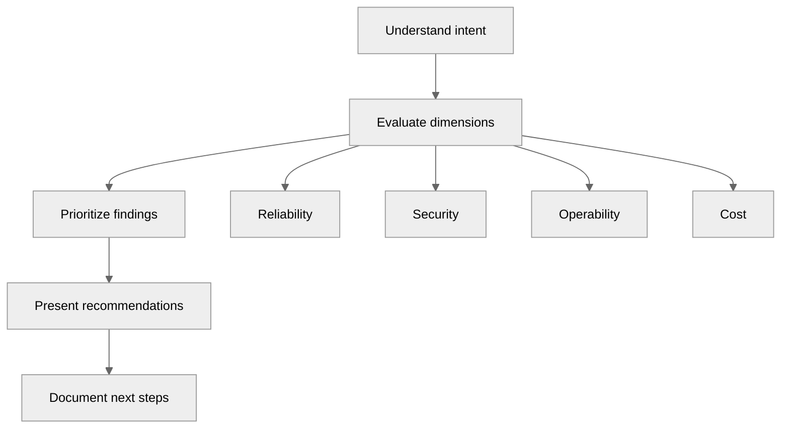

---
tags:
  - architecture
  - customer-facing
---

## Architecture Design Review

## 📝 Context

You're reviewing a customer's proposed or existing architecture to identify risks,
misalignments, and opportunities before they commit to implementation. This is not
a sales conversation — it's a consulting engagement where your credibility depends
on honest assessment, including recommending against your own product when warranted.

## 📋 Pre-Review Checklist

- [ ] Obtain architecture diagrams (current state and proposed)
- [ ] Understand the business drivers behind the architecture decisions
- [ ] Know who's in the room 👥 — architects, engineers, decision-makers?
- [ ] Review any prior discovery or technical deep-dive notes
- [ ] Prepare your review framework (see below)
- [ ] Have reference architectures ready for comparison
- [ ] Identify the constraints they're working within (budget, timeline, team skill)
- [ ] Block time after for written findings ⏱️ 30-60 min

## 🎯 Design Review Framework

### Step 1: Understand Intent Before Critiquing Design

Before evaluating the architecture, understand what it's trying to achieve:

- What business outcome does this architecture serve?
- What are the non-negotiable requirements? (compliance, latency, cost ceiling)
- What constraints shaped the current design? (team size, existing contracts, timeline)
- What tradeoffs were they aware of when they made these choices?
- What's the expected lifespan of this architecture? (1 year? 5 years?)

**Why this matters:** Criticizing a design without understanding its constraints is how
you lose the room. An "ugly" architecture that works within their constraints is better
than a "clean" one they can't build or operate.

### Step 2: Evaluate Across Dimensions

Review the architecture against these dimensions. Not all apply to every review — focus
on the ones that matter for this customer's context.

**Reliability & Resilience**

- What are the single points of failure?
- How does the system handle component failures?
- What's the blast radius of a failure in each layer?
- Are there circuit breakers, retries, and fallbacks?
- What's the recovery time objective (RTO) and recovery point objective (RPO)?
- Is there a disaster recovery strategy? Has it been tested?

**Scalability**

- What's the expected load profile? (steady, bursty, seasonal)
- Where are the bottlenecks under 10x load?
- Can components scale independently?
- Are there stateful components that limit horizontal scaling?
- What's the cost curve as load increases? (linear, exponential, stepped)

**Security**

- What's the trust boundary model?
- How is authentication and authorization handled across services?
- Is data encrypted in transit and at rest?
- What's the secrets management strategy?
- Are there network segmentation and least-privilege controls?
- How are vulnerabilities tracked and patched?

**Operability**

- Can the team that built this operate it? At 2 AM?
- What's the observability story? (metrics, logs, traces)
- How are deployments done? Can they be rolled back?
- What does incident response look like?
- Is there runbook coverage for common failure modes?

**Cost**

- What's the estimated monthly/annual run cost?
- Are there idle resources or over-provisioned components?
- What's the cost-to-serve per unit of business value?
- Are there commitment discounts (reserved instances, savings plans) being used?
- What happens to cost if traffic doubles?

**Maintainability**

- Can a new team member understand this architecture in a week?
- Are services appropriately bounded? (not too coarse, not too granular)
- Is there a clear dependency graph or is it a tangled web?
- How do you make changes safely? What's the testing strategy?
- Are there components that only one person understands?

### Step 3: Prioritize Findings

Not all findings are equal. Categorize them:

| Priority | Criteria | Action |
| --- | --- | --- |
| 🔴 Critical | Risk of outage, data loss, security breach, or compliance failure | Address before go-live |
| 🟡 High | Performance degradation, operational burden, cost inefficiency | Address within first quarter |
| 🟢 Medium | Technical debt, missing observability, documentation gaps | Plan into roadmap |
| ⚪ Low | Best-practice deviations with minimal practical impact | Note for future reference |

### Step 4: Present Recommendations

Structure your review output as:

**Finding:** What you observed
**Risk:** What could go wrong and how likely it is
**Recommendation:** What to change and why
**Tradeoff:** What the recommendation costs (time, money, complexity)
**Alternative:** A lighter option if the full recommendation isn't feasible

### Design Review Document Template

**Architecture Review: [Customer/Project Name]**

**Date:** [Date]
**Reviewer:** [Your name]
**Participants:** [Names and roles]
**Architecture version reviewed:** [Version or date of diagrams]

**Executive Summary:**
[2-3 sentences: overall assessment, top risks, key recommendations]

**Scope:**
[What was reviewed and what was explicitly not reviewed]

**Findings:**

| # | Finding | Priority | Recommendation | Effort |
|---|---------|----------|----------------|--------|
| 1 | [Finding] | 🔴 | [Recommendation] | [S/M/L] |
| 2 | [Finding] | 🟡 | [Recommendation] | [S/M/L] |

**Detailed Findings:**
[Expanded analysis for each finding with context, risk, and alternatives]

**Next Steps:**
- [ ] [Action item with owner and date]

## ⚠️ Gotchas

- Reviewing without understanding constraints — makes you look out of touch
- Leading with criticism — start with what's working, then address risks
- Boiling the ocean — focus on the 3-5 findings that actually matter
- Recommending a redesign when they need a fix — match your recommendation to their timeline
- Ignoring the team's skill level — a perfect architecture they can't operate is worse than a simple one they can
- Presenting findings without alternatives — every critique needs a path forward
- Not documenting the review — verbal feedback gets forgotten and disputed

## 🔗 Links

- [Reference Architectures](reference-architectures.md)
- [Well-Architected Review](well-architected.md)
- [ADR Template](adr-template.md)
- [Technical Deep-Dive](../pre-sales/technical-deep-dive.md)
- [Discovery Call](../pre-sales/discovery.md)
