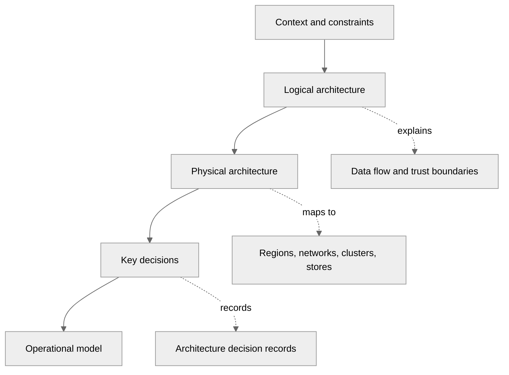
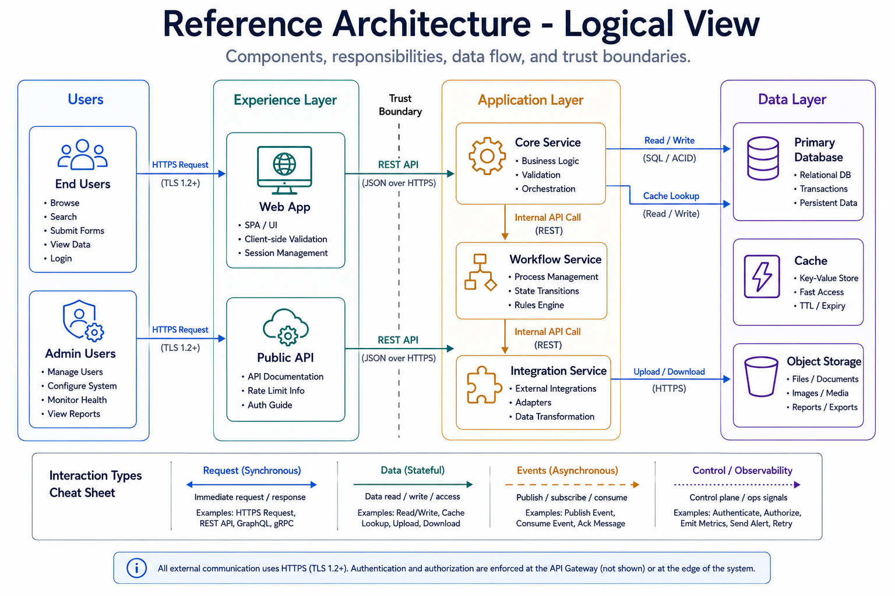
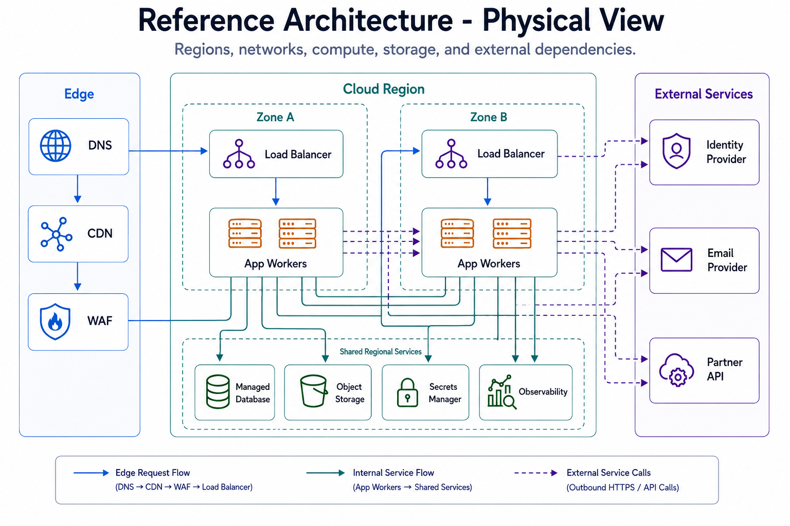
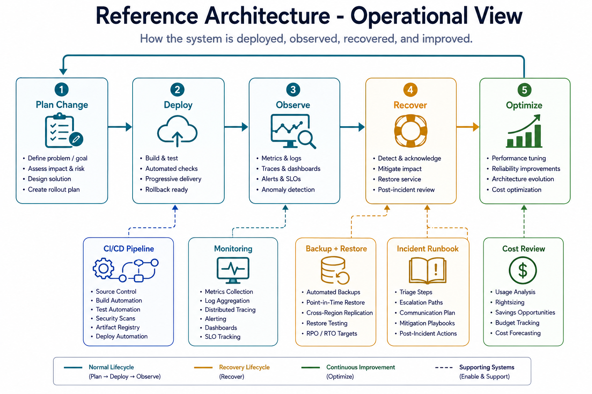

---
tags:
  - architecture
  - customer-facing
---

## Reference Architectures

## 📝 Context

You need to provide a customer with a starting-point architecture for their use case.
Reference architectures are not prescriptions — they're opinionated starting points that
accelerate design conversations by giving everyone something concrete to react to.

## 📋 When to Use Reference Architectures

- [ ] Customer is starting a new project and needs architectural direction
- [ ] Customer's existing architecture has fundamental issues and needs rethinking
- [ ] You need to illustrate how components fit together during a design review
- [ ] Customer asks "how would you architect this?" and needs more than a whiteboard sketch
- [ ] You're comparing approaches and need a baseline for each option

## 🎯 Building a Reference Architecture

### What Makes a Good Reference Architecture

A reference architecture should be:

- **Opinionated but adaptable** — take clear positions on technology choices, but explain
  which constraints would change the recommendation
- **Layered** — show the architecture at multiple levels of abstraction (business flow,
  logical components, physical deployment)
- **Honest about tradeoffs** — every architecture choice has a cost. Name it.
- **Scoped** — cover one use case well rather than trying to be universal

### Structure

**1. Context & Constraints**

Start with what shaped the architecture:

- Business requirements (latency, throughput, availability targets)
- Team constraints (size, skill set, on-call capacity)
- Compliance requirements (data residency, encryption, audit logging)
- Budget constraints (monthly run-rate ceiling)
- Existing systems that must be integrated with

**2. Logical Architecture**

Component-level view showing:

- Service boundaries and responsibilities
- Data flow between components
- Integration points with external systems
- Trust boundaries and security zones
- Async vs. sync communication patterns

<figure class="sp-figure">
  
  <figcaption>Logical view — components, responsibilities, data flow, and trust boundaries.</figcaption>
</figure>

**3. Physical Architecture**

Deployment-level view showing:

- Infrastructure layout (regions, availability zones, clusters)
- Network topology (VPCs, subnets, load balancers)
- Data stores and their replication topology
- Compute placement (containers, serverless, VMs)
- CDN and edge placement if applicable

<figure class="sp-figure">
  
  <figcaption>Physical view — regions, network, compute, storage, and external dependencies.</figcaption>
</figure>

**4. Key Decisions**

For each major architectural choice, document:

- What was decided
- What alternatives were considered
- Why this option was chosen given the constraints
- When you'd revisit this decision (see [ADR Template](adr-template.md))

**5. Operational Model**

How this architecture is run day-to-day:

- Deployment strategy (blue-green, canary, rolling)
- Monitoring and alerting approach
- Backup and disaster recovery
- Scaling triggers and mechanisms
- On-call and incident response expectations

<figure class="sp-figure">
  
  <figcaption>Operational view — how the system is deployed, observed, recovered, and improved.</figcaption>
</figure>

### Common Reference Architecture Patterns

**Web Application (Three-Tier)**

- When: Standard request-response workloads, CRUD-heavy applications
- Components: CDN → Load Balancer → Application Tier → Database
- Key decisions: Managed database vs. self-hosted, session management, caching layer
- Watch out for: Stateful application servers blocking horizontal scaling

**Event-Driven Processing**

- When: Async workloads, decoupled producers/consumers, variable throughput
- Components: Event source → Message broker → Processors → Data stores
- Key decisions: Message ordering guarantees, exactly-once vs. at-least-once, dead letter queues
- Watch out for: Debugging distributed async flows, poison messages, consumer lag
- See also: [Event-Driven Patterns](../patterns/event-driven.md)

**Microservices**

- When: Multiple teams, independent deployment cycles, domain-driven boundaries
- Components: API Gateway → Service mesh → Individual services → Shared data infrastructure
- Key decisions: Service boundaries, inter-service communication, data ownership
- Watch out for: Distributed monolith, chatty services, operational complexity outpacing team capacity
- See also: [Microservices Patterns](../patterns/microservices.md)

**Data Pipeline**

- When: ETL/ELT workloads, analytics, ML feature engineering
- Components: Ingestion → Processing → Storage → Serving
- Key decisions: Batch vs. stream, schema-on-read vs. schema-on-write, data partitioning
- Watch out for: Late-arriving data, schema evolution, pipeline debugging
- See also: [Data Mesh Patterns](../patterns/data-mesh.md)

**Hybrid Cloud**

- When: Regulatory constraints, migration in progress, burst capacity needs
- Components: On-prem core → Connectivity layer → Cloud extension
- Key decisions: What stays on-prem vs. what moves, connectivity model, identity federation
- Watch out for: Latency between environments, split-brain scenarios, inconsistent tooling
- See also: [Hybrid Environment Guide](../environments/hybrid.md)

## 🎯 Presenting Reference Architectures

**Do:**

- Present as a starting point, not a finished design — "Here's how we'd typically approach this"
- Walk through the decisions, not just the boxes and arrows
- Highlight where their constraints would change the design
- Leave room for their input — the best architecture incorporates their domain knowledge

**Don't:**

- Present it as the only option — always have an alternative
- Skip the "why" — boxes on a diagram without rationale are meaningless
- Ignore their existing investments — a reference architecture that requires ripping out everything they have is a non-starter
- Over-engineer — match complexity to their team's capacity to operate it

## ⚠️ Gotchas

- Reference architectures that assume unlimited budget — always include a "lighter" variant
- Diagrams without decision rationale — why this component? why not the alternative?
- Ignoring the team that has to operate it — a two-person team can't run a 30-service mesh
- Not updating reference architectures as services evolve — stale references erode trust
- Presenting cloud-specific architectures to multi-cloud customers without adaptation
- Treating reference architectures as immutable — they should be versioned and evolved

## 🔗 Links

- [Design Review](design-review.md)
- [Well-Architected Review](well-architected.md)
- [ADR Template](adr-template.md)
- [Microservices Patterns](../patterns/microservices.md)
- [Event-Driven Patterns](../patterns/event-driven.md)
- [Environment Guides](../CONTENT-INDEX.md#environment-guides)
