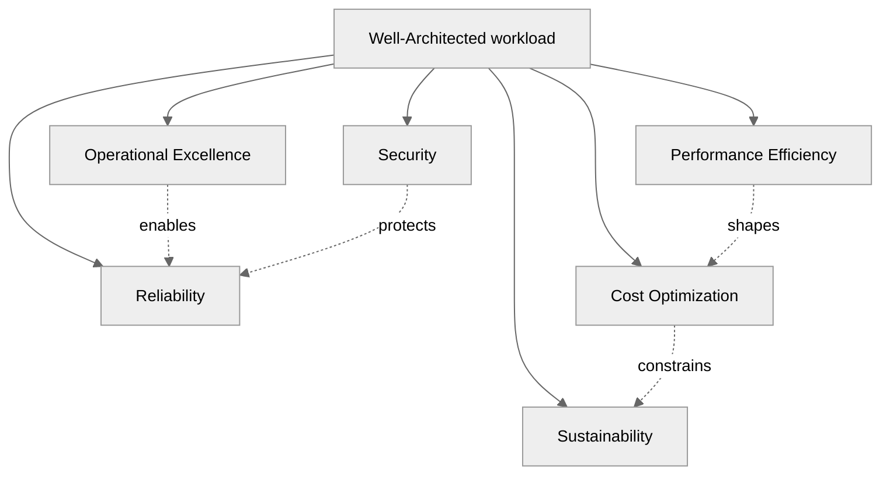
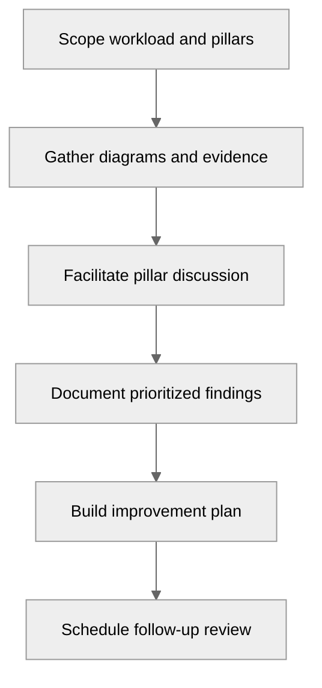

---
tags:
  - architecture
  - customer-facing
---

## Well-Architected Review

## 📝 Context

You're conducting a structured review of a customer's workload against established
architectural best practices. This is a framework-driven assessment — not freeform
critique — that produces a prioritized list of improvements with clear business
justification for each.

## 📋 Pre-Review Checklist

- [ ] Identify the workload scope — what system or application are you reviewing?
- [ ] Get architecture diagrams and documentation
- [ ] Understand the business criticality of the workload
- [ ] Know who owns the workload 👥 and who will action the findings
- [ ] Decide which pillars are most relevant (see below)
- [ ] Schedule 2-4 hours for the review conversation
- [ ] Prepare pillar-specific questions in advance

## 🎯 The Six Pillars

The Well-Architected Framework evaluates workloads across six pillars. Not every
pillar carries equal weight for every workload — prioritize based on the customer's
business context.

### 1. Operational Excellence

**Core question:** Can you run this in production without heroics?

**Review areas:**

- How are changes deployed? Is there a CI/CD pipeline?
- What happens when a deployment fails? Can you roll back?
- How do you detect problems? (Monitoring, alerting, dashboards)
- Are runbooks documented for common operational tasks?
- How do you learn from incidents? Is there a postmortem process?
- What's automated vs. manual? What should be automated but isn't?

**Red flags:**

- Deployments that require manual steps beyond "click deploy"
- No rollback mechanism
- Alerting that's either silent or so noisy it gets ignored
- "Only one person knows how to do this"

### 2. Security

**Core question:** How do you protect data, systems, and access?

**Review areas:**

- Identity and access management — who can do what? How is it enforced?
- Data protection — encryption at rest and in transit, key management
- Network security — segmentation, firewall rules, ingress/egress controls
- Detection — how do you know when something is wrong?
- Incident response — what happens when a security event occurs?
- Compliance — what regulatory requirements apply and how are they met?

**Red flags:**

- Shared credentials or overly broad IAM policies
- Unencrypted data stores or connections
- No network segmentation between workloads
- Security logs that nobody reviews
- No incident response plan

### 3. Reliability

**Core question:** Does this workload recover from failures automatically?

**Review areas:**

- What are the single points of failure?
- How does the workload handle dependency failures? (retries, circuit breakers, fallbacks)
- What's the backup strategy? When was the last restore test?
- How is the workload deployed across failure domains? (AZs, regions)
- What are the defined SLAs/SLOs? Are they measured?
- What's the disaster recovery plan? Has it been tested?

**Red flags:**

- No multi-AZ deployment for production workloads
- Backups that have never been tested for restore
- SLAs defined but not measured
- No chaos testing or failure injection
- Single-region deployment for business-critical workloads

### 4. Performance Efficiency

**Core question:** Are you using the right resources for the job?

**Review areas:**

- Are compute, storage, and database services sized appropriately?
- Is there caching where it would help? (CDN, application cache, database cache)
- Are there performance bottlenecks under current or projected load?
- Is the architecture using managed services where appropriate?
- Are there opportunities to use serverless or event-driven patterns?
- How do you load test? When was the last time?

**Red flags:**

- Over-provisioned instances running at 5-10% utilization
- No caching layer for read-heavy workloads
- Database queries without indexes on common access patterns
- No load testing before launches or capacity changes
- Synchronous processing where async would work

### 5. Cost Optimization

**Core question:** Are you spending the right amount on the right things?

**Review areas:**

- What's the monthly cost? Is it tracked and forecasted?
- Are there idle or underutilized resources?
- Are commitment discounts (reserved instances, savings plans) being used?
- Is there right-sizing automation?
- Are development and staging environments running 24/7?
- What's the cost per business transaction or user?

**Red flags:**

- No cost visibility at the workload level
- Development environments running at production scale
- No use of spot/preemptible instances for fault-tolerant workloads
- Over-provisioned databases that could use a smaller tier
- No lifecycle policies on storage (old data staying in hot tiers)

See also: [TCO Framework](../cost-modeling/tco-framework.md) and [Cost Optimization](../cost-modeling/optimization.md)

### 6. Sustainability

**Core question:** Are you minimizing environmental impact without sacrificing performance?

**Review areas:**

- Are workloads running in energy-efficient regions?
- Is compute right-sized to avoid waste?
- Are idle resources shut down outside business hours?
- Is data stored in appropriate tiers based on access frequency?
- Are you using managed services that benefit from provider-level efficiency?

**Red flags:**

- 24/7 resources for 9-5 workloads
- Redundant data copies without retention policies
- Over-provisioned infrastructure "just in case"

## 🎯 Conducting the Review

**Step 1: Scope the review** — Pick the workload and agree on which pillars to prioritize.
A full six-pillar review takes 4-8 hours of conversation. Start with the 2-3 pillars
that matter most to this customer.

**Step 2: Gather information** — Review diagrams, configs, dashboards, and documentation
before the working session. Come with informed questions, not discovery questions.

**Step 3: Facilitated discussion** — Walk through each pillar with the workload team. Use
the questions above as a guide, not a script. The best insights come from follow-up
questions when something doesn't quite add up.

**Step 4: Document findings** — Use the same prioritization from [Design Review](design-review.md):
🔴 Critical, 🟡 High, 🟢 Medium, ⚪ Low.

**Step 5: Build improvement plan** — For each finding, define: what to do, effort estimate,
expected impact, and who owns it.

### Well-Architected Review Template

**Well-Architected Review: [Workload Name]**

**Date:** [Date]
**Reviewer:** [Your name]
**Workload owner:** [Name]
**Pillars reviewed:** [List]

**Executive Summary:**
[2-3 sentences: overall maturity, top risks, key improvements]

**Pillar Scores:**

| Pillar | Maturity | Top Finding | Priority |
|--------|----------|-------------|----------|
| Operational Excellence | [Low/Medium/High] | [Finding] | [🔴🟡🟢] |
| Security | [Low/Medium/High] | [Finding] | [🔴🟡🟢] |
| Reliability | [Low/Medium/High] | [Finding] | [🔴🟡🟢] |
| Performance | [Low/Medium/High] | [Finding] | [🔴🟡🟢] |
| Cost | [Low/Medium/High] | [Finding] | [🔴🟡🟢] |
| Sustainability | [Low/Medium/High] | [Finding] | [🔴🟡🟢] |

**Improvement Plan:**

| # | Finding | Pillar | Priority | Effort | Owner | Target Date |
|---|---------|--------|----------|--------|-------|-------------|
| 1 | [Finding] | [Pillar] | 🔴 | [S/M/L] | [Name] | [Date] |

## ⚠️ Gotchas

- Reviewing all six pillars when only two matter — scope to what's relevant
- Treating it as a checklist instead of a conversation — the value is in the discussion
- Producing a 50-page report nobody reads — keep findings actionable and prioritized
- Not connecting findings to business outcomes — "this is a risk" vs. "this could cost you $X in downtime"
- Running the review without the people who built the system — you need their context
- One-time review with no follow-up — schedule a re-review in 3-6 months

## 🔗 Links

- [Design Review](design-review.md)
- [Reference Architectures](reference-architectures.md)
- [ADR Template](adr-template.md)
- [Cost Optimization](../cost-modeling/optimization.md)
- [Security Architecture](../compliance/security-architecture.md)
