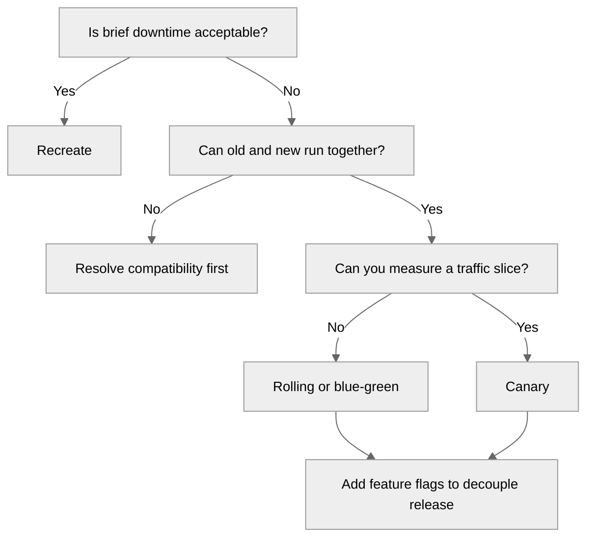
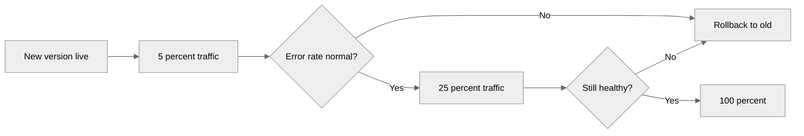

---
tags:
  - architecture
  - ci-cd
---

# Deployment Strategies

## 📝 Context

Once an artifact is built and tested, *how* it reaches production decides the blast radius
of a bad release. The strategy is the difference between "every user hit the bug" and
"2% of traffic hit it for ninety seconds, then we rolled back automatically."

This is the canonical home for rollout strategy. [Cutover Planning](../migration/cutover-planning.md)
applies these to a one-time migration; [Reference Architectures](../architecture/reference-architectures.md)
shows them in the operational view; this page is the reusable decision surface.

## 📋 Decision Checklist: Which Strategy?

- [ ] Can the old and new versions run **at the same time** against the same data?
- [ ] Is there spare capacity to run two versions (blue-green needs ~2× during cutover)?
- [ ] Can you shift a *fraction* of traffic and measure it (canary needs routing + metrics)?
- [ ] Is downtime acceptable, even briefly (recreate is simplest if yes)?
- [ ] Do you need to decouple *deploy* from *release* (feature flags)?

## 🎯 The Strategies

| Strategy | How it works | Rollback | Cost / risk | Best for |
| --- | --- | --- | --- | --- |
| **Recreate** | Stop old, start new | Redeploy old version | Downtime during swap | Dev/test, or apps that tolerate a maintenance window |
| **Rolling** | Replace instances batch by batch | Roll the batches back | Two versions live mid-roll; needs back-compat | Default for stateless services on orchestrators |
| **Blue-Green** | Stand up full new env, switch traffic at once | Flip traffic back to old | ~2× capacity during cutover | Fast, clean cutover with instant rollback |
| **Canary** | Route a small % to new, widen on health | Shift traffic back to old | Needs traffic routing + good metrics | High-traffic, risk-sensitive services |
| **Feature Flags** | Deploy dark, release by toggling per cohort | Turn the flag off | Flag debt if not cleaned up | Decoupling deploy from release; gradual exposure |

**The pairing that matters:** canary (or blue-green) controls *infrastructure* risk;
feature flags control *product* risk. They compose — ship the code dark behind a flag via a
canary deploy, then turn it on for 1% of users. Deploy ≠ release.

## 🧩 Worked Scenario: Canary the Order Service

The Order Service ships a rewritten pricing path. A bug here over-charges customers, so the
team will not flip it on for everyone at once.

  

    
1 · 5%

    
Route 5% of traffic to the new version. Bake for a fixed window and watch error rate and latency against the old version as the baseline.

  

  

    
2 · 25%

    
Healthy at 5%, widen to 25%. The blast radius of a missed bug is still a quarter of traffic, briefly — not all of it.

  

  

    
3 · 100%

    
Metrics hold, promote to full. The old version stays warm until the new one is proven, so rollback is instant.

  

  

    
Auto-rollback

    
At any step, an error-rate breach shifts traffic back to the old version automatically — no human in the loop at 2 a.m.

  

**The numbers (illustrative — set them from the customer's SLOs):** steps `5% → 25% → 100%`,
a bake window of `~10 min` per step, auto-rollback when error rate exceeds `~1%` over the
baseline. The point isn't the exact figures — it's that they're *defined and automated*
before the rollout, not decided live.

  
Say it like this

  
"We send 5% of traffic to the new version and compare its error rate to the old one. If it's clean, we widen to 25%, then 100%. If it degrades at any point, traffic shifts back automatically. The worst case is a small slice of users for a few minutes — not an all-hands outage."

## 👁️ Audience Lens

| Audience | What they care about |
| --- | --- |
| **Engineering** | Rollback speed, back-compat between versions, routing controls |
| **Product** | Which cohort sees what, and the ability to dark-launch then release |
| **Customer / Ops** | No surprise outages; degraded releases self-heal |

## ⚠️ Gotchas

- Canary without good metrics is just a slow full rollout — you need a baseline to compare against
- Rolling and canary require backward compatibility — old and new run together, including the database schema
- Blue-green forgets the database — duplicating compute is easy, duplicating stateful data is the hard part
- Feature-flag debt — flags that never get cleaned up become permanent hidden branches
- Treating deploy as release — shipping code is not the same as exposing it to users
- No defined rollback trigger — "we'll watch it" is not an automated threshold

## 🔗 Links

- [Pipeline Design](pipeline-design.md)
- [Cutover Planning](../migration/cutover-planning.md)
- [Migration Strategy](../migration/strategy.md)
- [Reference Architectures](../architecture/reference-architectures.md)
