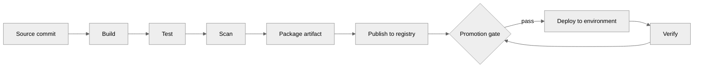
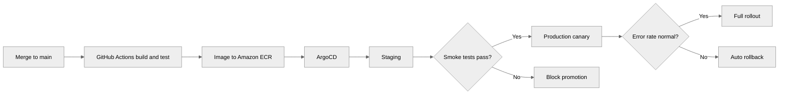

---
tags:
  - architecture
  - ci-cd
---

# CI/CD Pipeline Design

## 📝 Context

A delivery pipeline is how code becomes running software — automatically, repeatably, and
safely. For an SE/SA, the job is rarely to *write* the pipeline; it's to **assess, advise,
and de-risk** the customer's path to production. A weak pipeline is where POCs stall,
deployments slip, and "it works on my machine" becomes a support ticket.

This page is the home for the delivery pipeline itself. Deployment *strategies* live in
[Deployment Strategies](deployment-strategies.md); tool choice in
[Tooling Selection](tooling-selection.md); securing the pipeline in
[Pipeline Security](pipeline-security.md).

## 📋 Decision Checklist: Is the Pipeline Healthy?

- [ ] Every change reaches production through the **same** automated path (no manual hotfixes)
- [ ] The build is reproducible — same commit produces the same artifact
- [ ] Tests gate promotion; a red build cannot reach production
- [ ] Each environment (dev → staging → prod) is promoted from the **same artifact**, not rebuilt
- [ ] Rollback is a known, rehearsed, one-step action — not an improvisation
- [ ] Secrets are injected at deploy time, never baked into the artifact
- [ ] The pipeline emits signal: who deployed what, when, and whether it's healthy

**If most of these are no:** the customer doesn't have a delivery problem, they have a
delivery *risk*. Name it early — it shapes POC scope, timelines, and go-live confidence.

## 🧩 Worked Scenario: Commit to Production

The Order Service from the [microservices](../patterns/microservices.md) and
[API Gateway](../patterns/api-gateway.md) examples needs a new field on the order payload.
A developer merges one commit. Here's the path that change takes — built once, promoted
through environments, never rebuilt.

  

    
1 · Build once

    
GitHub Actions builds and tests the commit, then publishes <strong>one</strong> immutable image (tagged by commit SHA) to Amazon ECR.

  

  

    
2 · Promote, don't rebuild

    
ArgoCD deploys <em>that same image</em> to staging. The artifact that ships to prod is byte-for-byte what passed staging.

  

  

    
3 · Gate on evidence

    
Smoke tests in staging are the promotion gate. They pass, or the change does not move forward.

  

  

    
4 · Roll out and watch

    
Production takes the image as a canary, watches error rate, and auto-rolls-back if it degrades — never a 2 a.m. manual revert.

  

**Why this beats "build per environment":** rebuilding for prod means the artifact you
tested is not the artifact you shipped — the single most common source of "it worked in
staging." Build once, promote the same bytes, and staging becomes a real predictor of prod.

  
Say it like this

  
"We build the artifact one time and promote that exact image through staging to production. Nothing gets rebuilt on the way — so when staging is green, you're testing the thing that actually ships, not a close cousin of it."

## 🎯 Core Concepts

### CI vs. CD vs. CD

Three terms, often blurred. Keep them distinct on a whiteboard.

| Term | What it means | Ends when |
| --- | --- | --- |
| **Continuous Integration** | Every merge is built and tested automatically | A tested, packaged artifact exists |
| **Continuous Delivery** | That artifact is *always* releasable; promotion to prod is a one-click decision | A human approves the release |
| **Continuous Deployment** | Every passing change goes to prod automatically, no human gate | The change is live |

**The honest distinction:** most regulated customers want continuous *delivery* (auto up to
a human-approved prod gate), not continuous *deployment*. Don't oversell full automation
into an environment that needs a change-approval record.

### Stages and gates

A stage *does* work (build, test, scan, deploy). A gate *decides* whether to proceed
(tests green, scan clean, approval granted, health stable). Strong pipelines fail at gates
**early and loudly** — a unit-test failure should stop the line in minutes, not surface as
a prod incident.

### Environment promotion

The same artifact moves dev → staging → prod, with configuration (not code) injected per
environment. Config and secrets are environment-specific; the binary is not.

### State the numbers

Vague pipeline advice invites the follow-up you can't answer. Ballpark targets below are
**illustrative** — measure the customer's real numbers, don't quote these as fact.

| Stage | Illustrative budget | Why it matters |
| --- | --- | --- |
| Build | `~6 min` | Slow builds kill iteration; cache dependencies and layers |
| Test (unit + integration) | `~4 min` | The fast feedback gate — keep it under the coffee threshold |
| Image size | `~120 MB` | Smaller images pull faster and shrink the attack surface |
| Staging → prod promotion | `minutes, not days` | Long promotion windows hide risk and batch changes |
| Rollback | `< 5 min, one step` | If rollback is slow or manual, teams avoid deploying |

## 🚨 Failure Paths

The layer that separates a demo pipeline from a production one is what happens when a stage
fails. Every failure should be **visible, attributed, and non-destructive.**

| Failure | What the pipeline does | Why |
| --- | --- | --- |
| Build fails | Stop, notify the author, mark the commit red | Broken code never produces an artifact |
| Tests fail in staging | Block promotion to prod; artifact stays in staging | A red gate is the whole point of the gate |
| Security scan flags a critical CVE | Fail the gate, surface the finding | Shipping a known-critical is worse than a delayed release |
| Prod deploy degrades (error rate / latency) | Auto-rollback to the previous artifact | Mean-time-to-recovery beats mean-time-to-debug |
| Migration step fails mid-deploy | Halt, alert, hold at last-good state | Partial deploys are the hardest to reason about |

  
Say it like this

  
"Failure is a normal pipeline state, not an emergency. A bad build stops at build, a bad change stops at the staging gate, and a bad rollout rolls itself back. The customer's blast radius shrinks at every stage instead of all landing in production."

## 👁️ Observability — Who Sees What

A pipeline that nobody can see into still generates "is it deployed yet?" Slack threads.
Decide deliberately what each audience sees.

| Audience | What they see | Why it matters |
| --- | --- | --- |
| **Engineering** | Full build/test logs, per-stage timing, the failing step | Diagnose a red pipeline without guesswork |
| **Security** | Scan results, SBOM, which CVEs gated a release | Evidence for audits; no shipping unknown risk |
| **Product / Ops** | Deployment status, what's live where, health after release | Answer "is it out?" without pinging engineering |
| **Finance / leadership** | Deployment frequency, lead time, change-fail rate | Delivery health as a business signal, not a vibe |

## 🎯 Evaluating a Customer's Pipeline

When reviewing an existing pipeline, look for these smells.

| Smell | What it indicates | Recommendation |
| --- | --- | --- |
| Manual steps in the deploy path | Tribal knowledge, un-repeatable releases | Automate the path; a runbook is not a pipeline |
| Rebuilds the artifact per environment | Staging doesn't predict prod | Build once, promote the same image |
| No rollback plan (or "redeploy the old branch") | Recovery is improvised under pressure | Make rollback a one-step, rehearsed action |
| Tests exist but don't gate promotion | Green is decorative | Wire tests to block promotion |
| Secrets baked into images | Credential leak waiting to happen | Inject secrets at deploy via the platform |
| Deploys batched weekly/monthly | Large, risky changes; slow recovery | Shrink batch size; deploy smaller, more often |
| No deployment metrics | Can't tell if delivery is improving | Track DORA metrics (see [Tooling Selection](tooling-selection.md)) |

## ⚠️ Gotchas

- Treating the pipeline as one team's tool — it's a shared contract across dev, security, and ops
- Building per environment — the artifact you test must be the artifact you ship
- Gates that warn but don't block — a non-blocking gate is documentation, not control
- No artifact immutability — overwriting a tag means you can't trust what's deployed
- Manual rollback — if recovery is slow, teams stop deploying, and changes pile up
- Ignoring pipeline run time — a 40-minute pipeline is a 40-minute feedback loop
- Skipping the constrained-environment question — air-gapped and regulated pipelines look very different (see [Air-Gapped](../environments/air-gapped.md))

## 🔗 Links

- [Deployment Strategies](deployment-strategies.md)
- [Tooling Selection](tooling-selection.md)
- [Pipeline Security](pipeline-security.md)
- [Cutover Planning](../migration/cutover-planning.md)
- [Reference Architectures](../architecture/reference-architectures.md)
- [Air-Gapped Environments](../environments/air-gapped.md)
