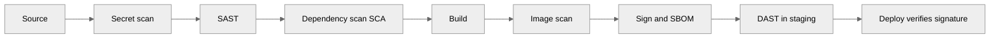

---
tags:
  - architecture
  - ci-cd
  - security
  - compliance
---

# Pipeline Security

## 📝 Context

The pipeline is a high-value target: it has credentials, builds the artifacts that run in
production, and is often trusted implicitly. [Security Architecture](../compliance/security-architecture.md)
covers the *application* layer; this page owns the **pipeline layer** — securing the path
from commit to running artifact, and proving it to an auditor.

The shift that matters: move security controls *left*, into the pipeline, so problems are
caught before they ship — not after.

## 📋 Checklist: Is the Pipeline Trustworthy?

- [ ] Code, dependencies, and images are scanned **before** an artifact is published
- [ ] The build runs with short-lived, scoped credentials — no long-lived secrets in CI
- [ ] Artifacts are signed; deploys verify the signature
- [ ] There's a bill of materials (SBOM) for what's in each release
- [ ] A failed security gate **blocks** the release, it doesn't just warn
- [ ] Pipeline definitions are code-reviewed like any other change

## 🎯 Where Controls Sit in the Pipeline

Each control has a natural home in a stage. Placement is the whole point — a scan that runs
*after* deploy is a report, not a gate.

| Control | Stage | Catches |
| --- | --- | --- |
| **Secret scanning** | Source | Credentials committed to the repo |
| **SAST** | Pre-build | Vulnerable code patterns (injection, unsafe APIs) |
| **SCA** | Pre-build | Known CVEs in dependencies |
| **Image scanning** | Post-build | Vulnerable OS packages in the container |
| **Signing + SBOM** | Package | Tampering; an inventory of what shipped |
| **DAST** | Staging | Runtime vulnerabilities against a live instance |

## 🎯 Supply Chain Integrity

Scanning tells you what's *wrong*; supply-chain controls prove what's *real*.

- **Artifact signing** — sign images at build; the deploy step refuses anything unsigned or
  signed by an unknown key. This blocks "someone pushed a rogue image to the registry."
- **SBOM (Software Bill of Materials)** — a machine-readable inventory of every component in
  a release. When the next Log4j drops, an SBOM answers "are we affected?" in minutes.
- **Provenance (SLSA)** — attest *how* and *where* an artifact was built, so a consumer can
  verify it came from the real pipeline, not a developer laptop.
- **Dependency pinning** — pin versions and verify hashes so a dependency can't change under
  you between build and deploy.

## 🎯 Secrets in CI

The most common pipeline finding is a long-lived cloud credential sitting in CI config.

- **Prefer OIDC / workload identity** — the pipeline exchanges a short-lived token for cloud
  access per run. Nothing long-lived to leak.
- **Inject at deploy, never bake** — secrets enter at deploy time from the platform's secret
  store; they're never built into the image.
- **Scope tightly** — a build credential should reach exactly the registry it needs, nothing
  more. This is the pipeline application of least privilege.

  
Say it like this

  
"We don't store long-lived cloud keys in the pipeline. Each run exchanges a short-lived token for exactly the access it needs, and secrets are injected at deploy time, never baked into the image. If a build log leaks, there's no standing credential to steal."

## 🎯 Compliance in the Pipeline

For regulated customers (SOC 2, FedRAMP, HIPAA), the pipeline *is* a control surface. Map
the requirement to a pipeline gate rather than a manual checklist.

| Requirement | Pipeline gate |
| --- | --- |
| Separation of duties | Author can't approve their own production promotion |
| Change is reviewed | Branch protection + required reviews before merge |
| Vulnerability management | SCA / image scan gate blocks criticals |
| Auditable change record | GitOps Git history, or signed deploy logs |
| Provenance of what's running | Signed artifacts + SBOM per release |

The advisory point: gates produce evidence automatically. A pipeline-as-control is far
cheaper to audit than a binder of screenshots.

## ⚠️ Gotchas

- Scans that warn but don't block — a non-blocking gate is a report, not a control
- Long-lived credentials in CI — the single most common and most damaging finding
- Signing without verifying — signatures only help if the deploy step actually checks them
- Treating SBOM as paperwork — its value shows up the day the next critical CVE lands
- Securing the app but not the pipeline — the pipeline can deploy anything, so it's high-value
- Pipeline definitions that skip review — an unreviewed workflow change is an unreviewed prod change

## 🔗 Links

- [Pipeline Design](pipeline-design.md)
- [Tooling Selection](tooling-selection.md)
- [Security Architecture](../compliance/security-architecture.md)
- [Air-Gapped Environments](../environments/air-gapped.md)
- [Regulatory Mapping](../compliance/regulatory-mapping.md)
