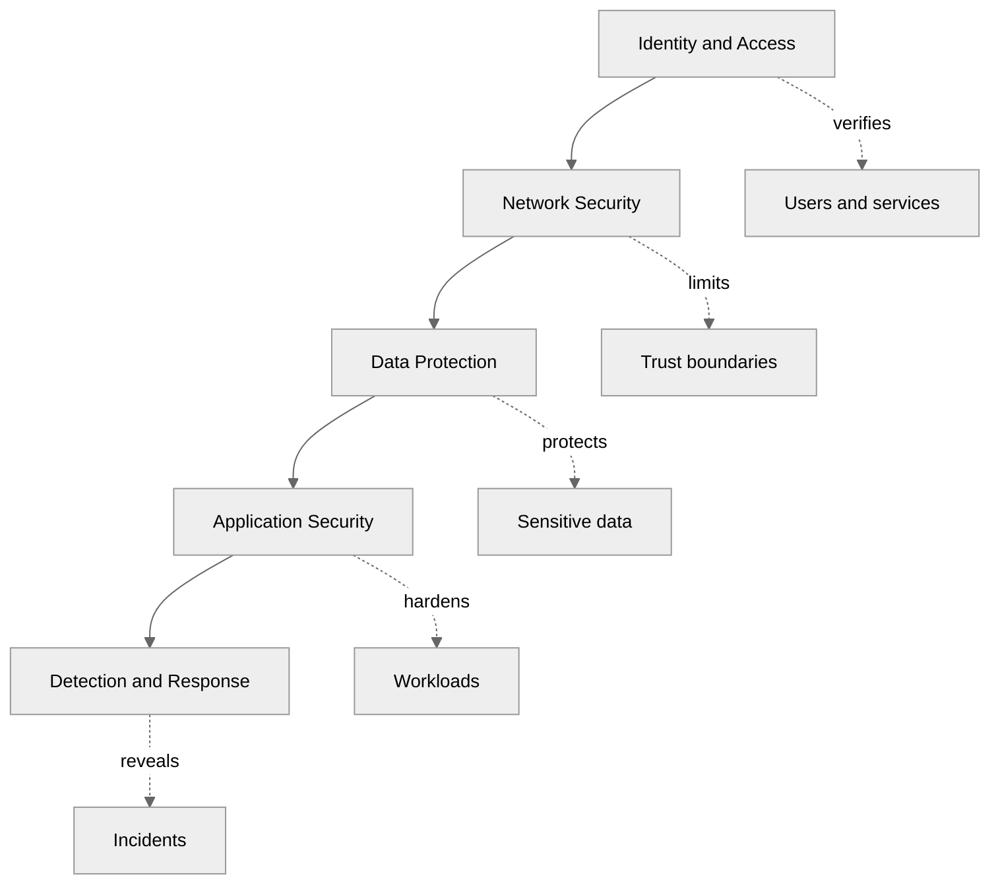

---
tags:
  - architecture
  - customer-facing
  - compliance
  - security
---

## Security Architecture

## 📝 Context

You're designing or reviewing the security posture of a customer's architecture. Security
architecture isn't a layer you bolt on after — it's a set of decisions woven into every
component. Your job is to ensure the architecture implements defense in depth without
creating so much friction that teams bypass controls.

## 📋 Security Review Checklist

- [ ] Understand the threat model — what are you protecting, from whom?
- [ ] Map trust boundaries — where does trusted meet untrusted?
- [ ] Review identity and access management
- [ ] Assess data protection (encryption, classification, lifecycle)
- [ ] Evaluate network security (segmentation, ingress/egress controls)
- [ ] Check secrets management
- [ ] Review logging and detection capabilities
- [ ] Understand incident response readiness
- [ ] Identify the customer's security team and their review process 👥

## 🎯 Security Architecture Framework

### Defense in Depth Layers

Security architecture operates across layers. A failure at any single layer should not
result in a complete breach.

**Layer 1: Identity & Access**

The foundation. If you get this wrong, nothing else matters.

- **Authentication:** How are users and services verified?
  - MFA enforced for all human access
  - Service-to-service authentication via mutual TLS, API keys, or IAM roles
  - No shared credentials, no long-lived tokens where short-lived alternatives exist
  - Session management with appropriate timeouts

- **Authorization:** Who can do what?
  - Least-privilege by default — start with no access, grant specific permissions
  - Role-based (RBAC) or attribute-based (ABAC) access control
  - Separate roles for read vs. write vs. admin
  - Regular access reviews (quarterly minimum)
  - Just-in-time privileged access with approval workflows

- **Identity federation:** How do identities span systems?
  - Centralized identity provider (IdP) for single source of truth
  - SAML or OIDC for SSO across applications
  - Consistent identity lifecycle (provisioning, deprovisioning)

**Layer 2: Network Security**

Control what can communicate with what.

- **Segmentation:** Divide the network into zones with explicit trust boundaries
  - Public-facing tier (DMZ)
  - Application tier (internal)
  - Data tier (most restricted)
  - Management tier (admin access only)

- **Ingress controls:** What enters the network?
  - WAF for web-facing applications
  - DDoS protection at the edge
  - API gateway for service endpoints
  - Rate limiting and throttling

- **Egress controls:** What leaves the network?
  - Explicit allowlist for outbound connections
  - NAT gateway or proxy for internet access from private subnets
  - DNS filtering to block known-bad domains
  - Data loss prevention for sensitive data

- **Service mesh / network policies:** How do services talk to each other?
  - mTLS between services
  - Network policies restricting pod-to-pod communication (in Kubernetes)
  - Service-to-service authorization

**Layer 3: Data Protection**

Protect data at every stage of its lifecycle.

- **Classification:** Not all data needs the same protection
  - Public: No restrictions
  - Internal: Access restricted to organization
  - Confidential: Access restricted to specific roles
  - Restricted: Subject to regulatory controls (PHI, PII, cardholder data)

- **Encryption:**
  - At rest: AES-256 with KMS-managed keys (or equivalent)
  - In transit: TLS 1.2+ for all connections
  - Key management: Centralized, with rotation policies
  - Consider client-side encryption for the most sensitive data

- **Data lifecycle:**
  - Retention policies aligned with business and regulatory requirements
  - Secure deletion when retention period expires
  - Backup encryption and access controls

**Layer 4: Application Security**

- Input validation and output encoding
- Dependency scanning (SCA) for known vulnerabilities
- Static analysis (SAST) integrated into CI/CD
- Dynamic testing (DAST) against running applications
- Container image scanning before deployment
- Runtime protection (RASP or WAF rules)

**Layer 5: Detection & Response**

- **Logging:** Centralized log collection for all layers
  - Authentication events (success and failure)
  - Authorization decisions (especially denials)
  - Data access events for sensitive data
  - Configuration changes
  - Network flow logs

- **Monitoring & alerting:**
  - Anomaly detection on access patterns
  - Threshold alerts for brute-force, privilege escalation
  - Integration with SIEM for correlation

- **Incident response:**
  - Documented IR plan with roles and escalation paths
  - Runbooks for common security scenarios
  - Regular tabletop exercises
  - Communication plan (internal, customers, regulators if required)

### Security Architecture Assessment Template

**Security Architecture Review: [Customer/Workload Name]**

**Threat model summary:** [What are we protecting, from what threats]
**Compliance requirements:** [HIPAA, SOC 2, PCI DSS, etc.]

| Layer | Current Maturity | Key Finding | Priority |
|-------|-----------------|-------------|----------|
| Identity & Access | [Low/Medium/High] | [Finding] | [🔴🟡🟢] |
| Network Security | [Low/Medium/High] | [Finding] | [🔴🟡🟢] |
| Data Protection | [Low/Medium/High] | [Finding] | [🔴🟡🟢] |
| Application Security | [Low/Medium/High] | [Finding] | [🔴🟡🟢] |
| Detection & Response | [Low/Medium/High] | [Finding] | [🔴🟡🟢] |

**Critical Gaps:**
- [ ] [Gap with remediation]

**Recommendations:**
- [ ] [Recommendation with priority, effort, and owner]

## ⚠️ Gotchas

- Security by obscurity — hiding things is not securing them
- Over-securing low-value data while under-securing high-value data — classify first, then protect
- Security controls that teams bypass because they're too painful — controls must be usable
- No logging or detection — prevention fails; you need to know when it does
- Treating security as one team's responsibility — security is everyone's job, with a team that enables it
- Not testing incident response — an untested IR plan is not a plan
- Security review as a gate at the end — involve security architecture from the design phase

## 🔗 Links

- [Regulatory Mapping](regulatory-mapping.md)
- [Data Residency](data-residency.md)
- [Well-Architected Review](../architecture/well-architected.md)
- [Design Review](../architecture/design-review.md)
- [Private Cluster Guide](../environments/private-cluster.md)
- [Firewall-Restricted Guide](../environments/firewall-restricted.md)
