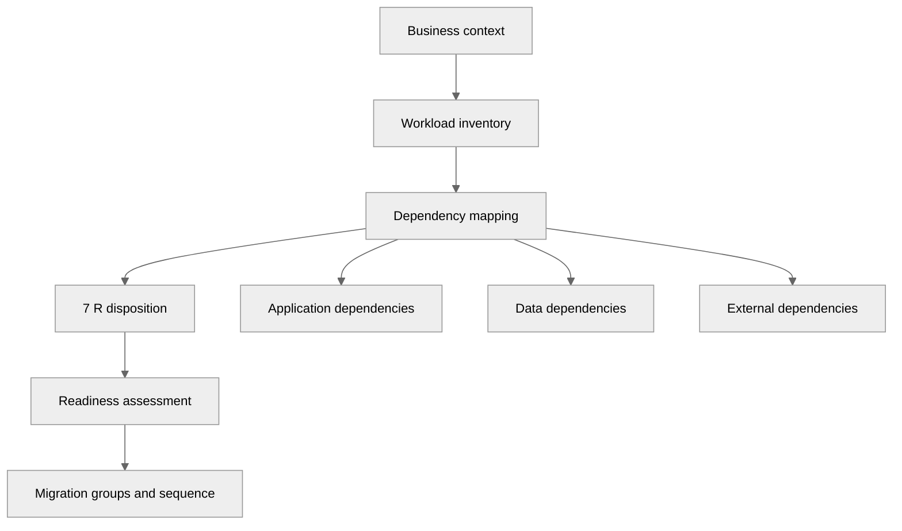

---
tags:
  - architecture
  - customer-facing
  - migration
---

## Migration Assessment

## 📝 Context

A customer is considering migrating workloads — to cloud, between clouds, between
data centers, or from legacy to modern infrastructure. Before anyone talks strategy
or timeline, you need to understand what they have, what's moving, and what makes
this hard. The assessment prevents the most common migration failure: discovering
complexity mid-flight.

## 📋 Assessment Checklist

- [ ] Inventory current workloads (applications, databases, integrations)
- [ ] Understand the business driver — why migrate, why now?
- [ ] Identify the decision-maker and the decision timeline
- [ ] Map dependencies between workloads
- [ ] Assess team readiness (skills, capacity, willingness)
- [ ] Identify compliance or regulatory constraints on data movement
- [ ] Understand the current cost baseline
- [ ] Determine risk tolerance — can they afford downtime during migration?

## 🎯 Assessment Framework

### Step 1: Business Context

Before touching anything technical, understand the motivation:

- **Why migrate?** Cost reduction, scalability, compliance, end-of-life hardware,
  acquisition, modernization, talent availability
- **What's the urgency?** Contract expiry, hardware end-of-support, compliance
  deadline, board mandate, competitive pressure
- **What does success look like?** Cost target, performance improvement, operational
  simplification, time-to-market reduction
- **What's the budget?** Migration isn't free — there's a cost to move and a cost to
  run in the new environment. Both need to be funded.
- **What's the risk appetite?** Can they tolerate downtime? Data loss? Partial migration?

### Step 2: Workload Inventory

Build a catalog of what needs to move:

| Workload | Type | Dependencies | Data Volume | Criticality | Complexity |
|----------|------|--------------|-------------|-------------|------------|
| [Name] | [Web app / DB / Batch / etc.] | [List] | [GB/TB] | [Critical / High / Medium / Low] | [High / Medium / Low] |

For each workload, capture:

- **Technology stack** — language, framework, database, middleware
- **Deployment model** — VMs, bare metal, containers, serverless
- **State** — stateless, stateful, database-backed, file-system-dependent
- **Integrations** — what it talks to, protocols used, latency sensitivity
- **Data characteristics** — volume, growth rate, sensitivity, retention requirements
- **Current SLA** — uptime, latency, throughput expectations
- **Ownership** — who built it, who runs it, who understands it

### Step 3: Dependency Mapping

This is where migrations get complicated. Map:

- **Application dependencies** — which services call which other services?
- **Data dependencies** — which applications share databases or data stores?
- **Infrastructure dependencies** — shared load balancers, DNS, certificates, secrets
- **External dependencies** — third-party APIs, SaaS integrations, partner connections
- **Implicit dependencies** — shared config, environment variables, file paths

**The goal:** Identify migration groups — sets of workloads that must move together
because they can't function independently during the transition.

### Step 4: The 7 R's — Migration Disposition

For each workload, determine the migration strategy:

| Strategy | What It Means | When to Use |
| --- | --- | --- |
| **Retire** | Turn it off | Workload is unused, redundant, or replaced |
| **Retain** | Keep where it is | Too risky, too complex, or no business case to move |
| **Relocate** | Lift-and-shift at infrastructure level | VMware-to-VMware, datacenter move |
| **Rehost** | Lift-and-shift to cloud VMs | Quick win, minimal changes, "move first, optimize later" |
| **Replatform** | Lift-and-shift with minor changes | Move to managed services (e.g., self-hosted DB → RDS) |
| **Refactor** | Rearchitect for cloud-native | High-value workloads that benefit from cloud capabilities |
| **Repurchase** | Replace with SaaS | Custom-built software that has a commercial equivalent |

**Default to the simplest viable strategy.** Refactoring everything is a multi-year
program. Rehosting gets workloads migrated and creates a foundation to optimize from.

### Step 5: Readiness Assessment

Evaluate organizational readiness, not just technical readiness:

**Technical readiness:**
- Network connectivity between source and target environments
- Identity and access management in the target environment
- Monitoring and observability in the target environment
- CI/CD pipeline adaptability
- Data migration tooling and bandwidth

**Organizational readiness:**
- Team skills for the target platform
- Change management process maturity
- Incident response capability in the new environment
- Training plan for operations team
- Communication plan for stakeholders

**Governance readiness:**
- Compliance validation in the target environment
- Security review and approval process
- Cost management and tagging strategy
- Access control and audit requirements

### Assessment Output Template

**Migration Assessment: [Customer Name]**

**Date:** [Date]
**Assessor:** [Your name]

**Executive Summary:**
[Business driver, scope, recommended approach, estimated timeline, key risks]

**Workload Inventory:** [X] total workloads assessed

| Disposition | Count | Notes |
|-------------|-------|-------|
| Retire | [X] | [Summary] |
| Retain | [X] | [Summary] |
| Rehost | [X] | [Summary] |
| Replatform | [X] | [Summary] |
| Refactor | [X] | [Summary] |
| Repurchase | [X] | [Summary] |

**Migration Groups:** [Dependency-based groupings]

**Readiness Gaps:**
- [ ] [Gap with remediation plan]

**Recommended Sequence:** [Which groups move first, second, third]

**Next Steps:**
- [ ] [Action with owner and date]

## ⚠️ Gotchas

- Incomplete dependency mapping — the dependencies you miss are the ones that cause outages
- Treating all workloads the same — a batch job and a customer-facing API have different migration strategies
- Ignoring data gravity — large data sets create latency and cost constraints that shape everything else
- Underestimating organizational change — technical migration is the easy part
- Not establishing a cost baseline — you can't prove cost savings without knowing what you spend today
- Assuming the customer knows their own inventory — they often don't
- Skipping the "retire" analysis — customers migrate workloads that should be turned off

## 🔗 Links

- [Migration Strategy](strategy.md)
- [Cutover Planning](cutover-planning.md)
- [Migration Risk Framework](risk-framework.md)
- [TCO Framework](../cost-modeling/tco-framework.md)
- [Discovery Call](../pre-sales/discovery.md)
