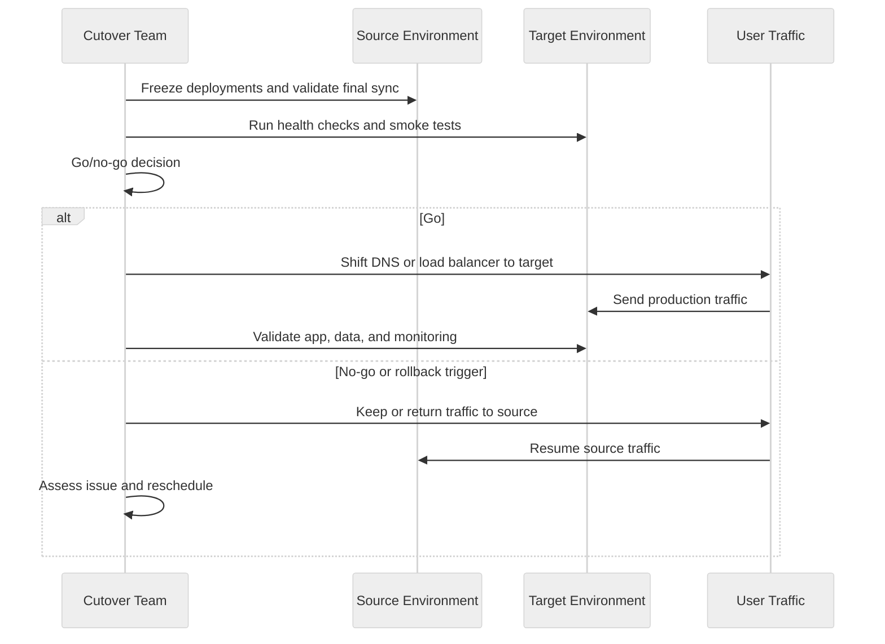

---
tags:
  - architecture
  - customer-facing
  - migration
---

## Cutover Planning

## 📝 Context

Cutover is the moment traffic shifts from the old environment to the new one. Everything
before this point is preparation. Everything after is operating in the new world. The
cutover plan defines exactly what happens, in what order, who does it, and what triggers
a rollback. There is no room for improvisation here.

## 📋 Cutover Readiness Checklist

- [ ] Target environment fully provisioned and validated
- [ ] Data migration complete or continuous replication running and healthy
- [ ] Application deployed and passing health checks in target environment
- [ ] Rollback plan documented, reviewed, and tested
- [ ] Monitoring and alerting configured and verified in target environment
- [ ] DNS changes prepared (records created, TTLs lowered in advance)
- [ ] Communication sent to all stakeholders with timeline and escalation contacts
- [ ] On-call coverage arranged for cutover window + 24 hours after
- [ ] Go/no-go decision made with sign-off from all required parties
- [ ] War room or communication channel set up for real-time coordination

## 🎯 Cutover Framework



### Cutover Patterns

Choose the pattern that matches the workload's downtime tolerance:

**Blue-Green Cutover**
- Deploy full stack in target environment alongside source
- Validate target independently
- Switch traffic via DNS or load balancer
- Keep source running as hot standby for rollback
- Best for: Stateless applications, web services
- Risk: Data divergence if both environments accept writes

**Rolling Cutover**
- Gradually shift traffic percentage from source to target
- Monitor error rates and latency at each increment
- Full cutover once confidence is established
- Best for: High-traffic services where blast radius must be limited
- Risk: Running two environments simultaneously increases operational complexity

**Maintenance Window Cutover**
- Schedule downtime, stop traffic, migrate final data, validate, bring up target
- Simplest approach but requires agreed downtime
- Best for: Internal applications, batch systems, databases with complex migrations
- Risk: Window overrun if issues arise during cutover

**Strangler Fig Cutover**
- Route specific routes or features to the new environment incrementally
- Coexist for an extended period
- Best for: Monolithic applications being decomposed during migration
- Risk: Long coexistence period increases maintenance burden

### Cutover Runbook Template

A cutover runbook is a step-by-step script for the cutover event. Every step must have
an owner, an expected duration, and a verification check.

```markdown
# Cutover Runbook: [Workload Name]

**Cutover window:** [Date, Start Time – End Time, Timezone]
**Rollback deadline:** [Time by which rollback must be initiated if issues persist]
**War room:** [Channel/link]

## Pre-Cutover (T-24h to T-0)

| Step | Action | Owner | Duration | Verification |
|------|--------|-------|----------|-------------|
| 1 | Lower DNS TTL to 60s | [Name] | 24h prior | `dig` shows new TTL |
| 2 | Final data sync validation | [Name] | 30 min | Row counts match within [X] |
| 3 | Freeze deployments to source | [Name] | Immediate | CI/CD pipeline paused |
| 4 | Notify stakeholders | [Name] | 10 min | Confirmation received |

## Cutover (T-0)

| Step | Action | Owner | Duration | Verification |
|------|--------|-------|----------|-------------|
| 5 | Stop writes to source (if applicable) | [Name] | 5 min | Write traffic = 0 |
| 6 | Final data sync | [Name] | [X] min | Replication lag = 0 |
| 7 | Validate data in target | [Name] | 15 min | Checksums match |
| 8 | Switch DNS/LB to target | [Name] | 5 min | Traffic flowing to target |
| 9 | Verify application health | [Name] | 15 min | Health checks passing |
| 10 | Verify end-to-end functionality | [Name] | 30 min | Smoke tests pass |

## Post-Cutover (T+0 to T+24h)

| Step | Action | Owner | Duration | Verification |
|------|--------|-------|----------|-------------|
| 11 | Monitor error rates | [Name] | Ongoing | Error rate < [X]% |
| 12 | Confirm rollback window | [Name] | Decision | Keep source warm for [X] hours |
| 13 | Notify stakeholders of completion | [Name] | 10 min | Confirmation sent |

## Rollback Procedure

| Step | Action | Owner | Duration | Verification |
|------|--------|-------|----------|-------------|
| R1 | Switch DNS/LB back to source | [Name] | 5 min | Traffic flowing to source |
| R2 | Verify source health | [Name] | 15 min | Health checks passing |
| R3 | Stop writes to target | [Name] | 5 min | Writes stopped |
| R4 | Assess data divergence | [Name] | [X] min | Delta report generated |
| R5 | Notify stakeholders of rollback | [Name] | 10 min | Sent |
```

### Go/No-Go Decision Framework

Before cutover, hold a go/no-go meeting. These criteria must be met:

**Go criteria (all must be true):**
- Target environment passing all health checks
- Data replication current (lag within acceptable threshold)
- Rollback tested within the last 48 hours
- All required personnel available for the cutover window
- No active incidents in source environment
- Stakeholders notified and no objections raised

**No-go triggers (any one is sufficient):**
- Active incident in source or target environment
- Data replication lag exceeding threshold
- Key personnel unavailable
- Unresolved critical findings from testing
- Stakeholder objection with unresolved concern

### Communication Template

**Pre-cutover notification:**

"We are proceeding with the [workload name] migration cutover on [date] from
[start time] to [end time] [timezone]. Expected impact: [description of any
user-visible impact]. Rollback plan is in place if issues arise. Status updates
will be posted to [channel] every [frequency]. Escalation contact: [name, phone]."

**Post-cutover notification:**

"The [workload name] migration cutover completed successfully at [time]. All
health checks are passing. We will continue monitoring for the next [X] hours.
Report any issues to [contact]. Source environment will remain available as
rollback target until [date]."

## ⚠️ Gotchas

- No rollback deadline — decide in advance when you'll call it, not during the crisis
- DNS TTLs not lowered in advance — if TTL is 3600s, your cutover takes an hour minimum
- Not freezing source deployments — someone deploys to source during cutover, causing divergence
- Data validation that takes too long — have pre-built validation scripts, don't write them live
- No war room or real-time coordination channel — cutover requires synchronized actions
- Cutover during high-traffic periods — schedule for lowest-traffic window
- Not keeping source warm after cutover — premature decommissioning removes your rollback path

## 🔗 Links

- [Migration Strategy](strategy.md)
- [Migration Assessment](assessment.md)
- [Migration Risk Framework](risk-framework.md)
- [Escalation](../recovery/escalation.md)
- [Troubleshooting](../implementation/troubleshooting.md)
