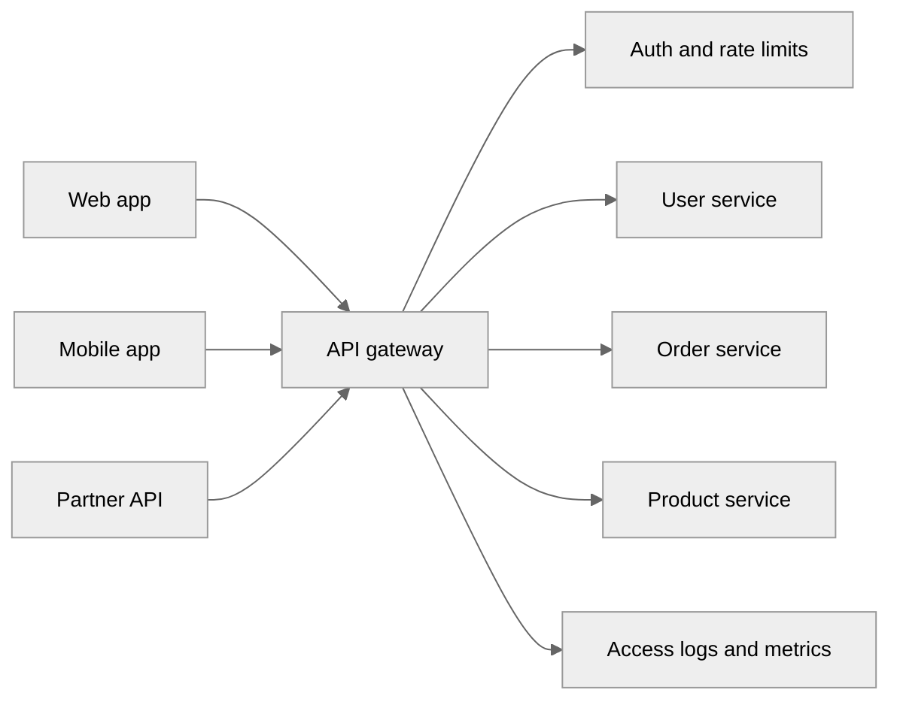
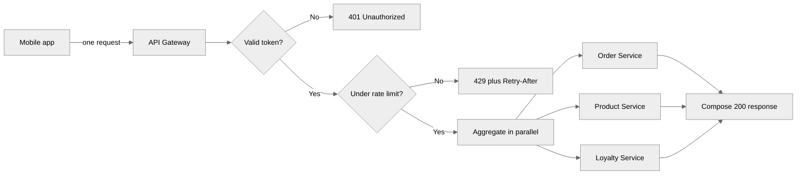
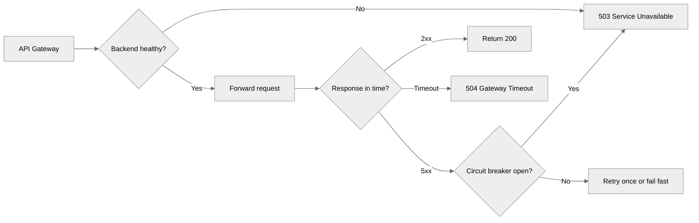

---
tags:
  - architecture
  - patterns
---

# API Gateway Patterns

## 📝 Context

The customer needs a strategy for exposing services to consumers — internal teams,
external partners, or public developers. An API gateway sits at the boundary between
consumers and backend services, handling cross-cutting concerns like authentication,
rate limiting, routing, and observability so individual services don't have to.

## 📋 Decision Checklist: Does This Need an API Gateway?

- [ ] Multiple backend services behind a single consumer-facing API
- [ ] Cross-cutting concerns (auth, rate limiting, logging) duplicated across services
- [ ] Need to present a stable API surface while backends evolve
- [ ] Multiple consumer types (web, mobile, partner, internal) with different API needs
- [ ] API versioning, deprecation, or lifecycle management required

**If this is a single service with one consumer type:** A gateway adds unnecessary
infrastructure. Handle auth and rate limiting in the service directly.

<div class="sp-say">
  <div class="sp-label">Say it like this</div>
  <p>"A gateway earns its place when you have several services behind one front door, or several kinds of consumers hitting them. If it's one service and one client, putting a gateway in front is just another hop to operate and pay for — I'd handle auth and limits in the service."</p>
</div>



## 🧩 Worked Scenario: One Screen, One Call

A mobile app opens the order-confirmation screen. That screen needs three things —
the order itself, the product details for each line item, and the customer's loyalty
status. Behind the gateway those are three internal services (**Order**, **Product**,
**Loyalty**). Instead of the app making three authenticated calls, it makes **one** call
to a gateway endpoint shaped for this screen (a BFF route).



<div class="sp-band">
  <div class="sp-step">
    <div class="sp-h">1 · Terminate &amp; authenticate</div>
    <div class="sp-d">Gateway ends TLS, validates the JWT, and extracts identity. An unauthenticated request never reaches a service.</div>
  </div>
  <div class="sp-step">
    <div class="sp-h">2 · Throttle</div>
    <div class="sp-d">Checks the caller against its rate limit. Over the limit returns <code>429</code> with <code>Retry-After</code> — the backends are never touched.</div>
  </div>
  <div class="sp-step">
    <div class="sp-h">3 · Route &amp; aggregate</div>
    <div class="sp-d">Fans out to Order, Product, and Loyalty in parallel and composes one payload shaped for this screen.</div>
  </div>
  <div class="sp-step">
    <div class="sp-h">4 · Cache &amp; log</div>
    <div class="sp-d">Caches the idempotent product lookup, emits one access log with latency and the upstreams hit, then returns <code>200</code>.</div>
  </div>
</div>

**Why this beats three direct calls:** the app makes one round trip instead of three,
the three services never implement auth or rate limiting themselves, and when the screen
later needs a fourth field, the BFF route changes — not the app.

<div class="sp-say">
  <div class="sp-label">Say it like this</div>
  <p>"The app makes one call to a route shaped for that screen. The gateway proves who you are, checks you're under your limit, fans out to the three services in parallel, and hands back a single payload. My services never see an unauthenticated request and never write rate-limiting code."</p>
</div>

## 🎯 Core Patterns

### Gateway Routing

The gateway routes requests to the appropriate backend service based on path, headers,
or other request attributes.

```
Consumer → Gateway → /users/* → User Service
                   → /orders/* → Order Service
                   → /products/* → Product Service
```

**Benefits:** Single entry point, simplified consumer configuration, backend services
can be moved or scaled independently.

**Risks:** Gateway becomes a single point of failure. Ensure high availability
(multi-AZ, auto-scaling).

### Gateway Aggregation

The gateway composes responses from multiple backend services into a single response
for the consumer. Useful when a single screen or operation requires data from multiple
services.

**When to use:**
- Mobile clients with latency sensitivity (one call better than five)
- Composing a view that spans multiple domains
- Reducing chattiness between consumer and backend

**When to avoid:**
- Complex business logic in the aggregation — that belongs in a service
- Aggregation requires transactional consistency — gateway can't manage transactions

### Backend for Frontend (BFF)

Separate gateway instances (or configurations) for different consumer types. Each BFF
is tailored to its consumer's needs.

```
Web App → Web BFF → Backend Services
Mobile App → Mobile BFF → Backend Services
Partner API → Partner BFF → Backend Services
```

**Why:** Web, mobile, and partner APIs have different payload requirements, authentication
flows, and rate limits. A single gateway trying to serve all of them becomes bloated.

**Tradeoff:** Multiple gateways to maintain. Justified when consumer needs genuinely diverge.

<div class="sp-say">
  <div class="sp-label">Say it like this</div>
  <p>"I reach for a BFF when the web, mobile, and partner clients start pulling the same endpoint in three directions. Rather than bloat one gateway with conditional payloads, I give each consumer a thin tailored layer over the same backends."</p>
</div>

### Gateway Offloading

Move cross-cutting concerns from individual services to the gateway:

| Concern | Gateway Handles | Service Handles |
| --- | --- | --- |
| **Authentication** | Token validation, identity extraction | Authorization (what this user can do) |
| **Rate limiting** | Per-consumer or per-API-key throttling | Business-level quotas if needed |
| **TLS termination** | External TLS, certificate management | Internal mTLS (service mesh) if required |
| **Request logging** | Access logs, latency metrics | Business event logging |
| **CORS** | Preflight handling, header management | Nothing (gateway handles it) |
| **Request/response transformation** | Header injection, format conversion | Business logic transformation |
| **Caching** | Response caching for idempotent GETs | Cache invalidation signals |

### API Versioning

How to evolve APIs without breaking existing consumers:

| Strategy | Mechanism | Tradeoff |
| --- | --- | --- |
| **URI versioning** | `/v1/users`, `/v2/users` | Explicit, easy to route. Clutters URI space. |
| **Header versioning** | `Accept: application/vnd.api.v2+json` | Clean URIs. Less discoverable, harder to test. |
| **Query parameter** | `/users?version=2` | Simple. Looks like a filter, not a version. |
| **No versioning (additive only)** | New fields added, old fields never removed | Simplest. Only works if you never break compatibility. |

**Recommendation:** URI versioning for external/partner APIs (explicitness wins).
Header versioning or additive-only for internal APIs (less ceremony).

<div class="sp-say">
  <div class="sp-label">Say it like this</div>
  <p>"For anything a partner consumes, I version in the URI — <code>/v2/orders</code> — because it's explicit and trivial to route. Internally, where I control both ends, I stay additive: new fields are fine, removing one is a breaking change I version for."</p>
</div>

## 🛡️ Reliability & Failure Handling

A gateway is the one place that sees every request, so it's where you protect consumers
from backend failures *and* backends from abusive load. This is the layer that separates a
demo from production.



### Rate limiting — with the numbers stated

Vague advice ("add rate limiting") invites the follow-up you can't answer. State the policy.
Use a token-bucket so short bursts are allowed but sustained abuse is throttled. Limits
below are **illustrative** — set real ones from observed traffic, not a guess.

| Caller | Limit (illustrative) | Over-limit response |
| --- | --- | --- |
| Unauthenticated (per IP) | `~60 req/min` | `429` + `Retry-After` |
| Authenticated (per API key) | `~1,000 req/min` | `429` + `Retry-After` |
| Burst | token bucket refills steadily | throttle when bucket is empty |

### Status codes the gateway returns

The gateway should fail in ways the consumer can act on — reject early, and never hang.

| Condition | Gateway returns | Reasoning |
| --- | --- | --- |
| Missing / invalid token | <span class="sp-pill bad">401</span> | Reject before any backend is touched |
| Authenticated but not permitted | <span class="sp-pill bad">403</span> | Coarse checks at gateway; fine-grained authz in the service |
| Over rate limit | <span class="sp-pill warn">429</span> | Return `Retry-After` so the client backs off correctly |
| Backend exceeded timeout | <span class="sp-pill warn">504</span> | AWS API Gateway's default integration timeout is **29s** (verified) |
| Backend unhealthy / circuit open | <span class="sp-pill warn">503</span> | Health check pulled it from the pool; fail fast, don't pile on |
| Backend returned `2xx` | <span class="sp-pill ok">200</span> | Pass through, log latency and upstream |

- **Health checks:** the gateway only routes to instances passing health checks — a dead backend is removed from rotation instead of returning errors to consumers.
- **Circuit breaker:** after N consecutive failures (illustrative, e.g. `5`), the breaker opens and the gateway fails fast with `503` instead of stacking requests on a struggling service. A half-open probe after a cooldown tests recovery.
- **Timeouts:** every hop has a budget. A consumer should get a clean `504` quickly, not a 30-second hang while the gateway waits on a dead backend.

<div class="sp-say">
  <div class="sp-label">Say it like this</div>
  <p>"The gateway protects the backends from each other. If the product service starts timing out, the circuit breaker opens and I return a fast 503 instead of stacking calls on a dying service — and a health check pulls the bad instance out of rotation. The consumer gets a clean status with a Retry-After, never a 30-second hang."</p>
</div>

## 👁️ Observability — Who Sees What

The gateway is the natural choke point for telemetry — every request passes through it.
Decide deliberately what each audience sees.

| Audience | What they see | Why it matters |
| --- | --- | --- |
| **Engineering** | Per-route p99 latency, error rates, upstream health, full access logs + traces | Pinpoint the slow hop without touching production |
| **Customer Success** | Per-consumer request volume, error summary, which key is being throttled | Answer "why are my calls failing" without pulling in engineers |
| **Partner / consumer dev** | `X-RateLimit-Remaining` headers, `429` + `Retry-After`, status page, developer portal | Self-serve — they know their limits before they hit them |
| **Alerting** | 5xx rate / p99 latency threshold → Datadog / PagerDuty / Slack | Catch degradation before consumers report it |

<div class="sp-say">
  <div class="sp-label">Say it like this</div>
  <p>"Every request gets one access log with its latency and the upstream it hit, so when someone says 'the API is slow' I point at the exact route and backend. Partners see their remaining quota in the response headers, so a 429 is never a surprise."</p>
</div>

## 🎯 Technology Selection

| Technology | Type | Best For | Considerations |
| --- | --- | --- | --- |
| **AWS API Gateway** | Managed | REST and WebSocket APIs on AWS | Per-request pricing, 29-sec timeout, deep AWS integration |
| **Kong** | Self-managed or cloud | Plugin-rich, multi-cloud | Lua-based plugins, active community, operational overhead if self-managed |
| **Envoy** | Proxy / Service mesh | High-performance, L4/L7, gRPC-native | Often paired with Istio, steep learning curve |
| **NGINX** | Proxy | Simple routing, TLS termination, static config | Lightweight, proven. Limited dynamic routing without Plus. |
| **Azure API Management** | Managed | Azure-native APIs, developer portal | Policy-based transformation, built-in developer portal |
| **Google Apigee** | Managed | Enterprise API management, monetization | Full API lifecycle management, complex feature set |
| **Traefik** | Proxy | Kubernetes-native, auto-discovery | Integrates with K8s ingress, good for container environments |

### Selection Criteria

- **Managed vs. self-managed:** Managed reduces operational burden but limits customization
- **Protocol support:** REST-only, or do you need gRPC, WebSocket, GraphQL?
- **Plugin ecosystem:** Can you extend it for custom auth, transformation, or validation?
- **Performance:** What's the latency overhead? (typically 1-5ms for well-configured gateways)
- **Multi-environment:** Can it run consistently across dev, staging, production?

## 🎯 API Design Principles for SA Engagements

When reviewing or designing APIs at the gateway layer:

- **Consistency over cleverness** — consistent naming, error formats, pagination across all APIs
- **Consumer-first design** — design the API the consumer wants to call, then figure out the backend routing
- **Versioning strategy decided upfront** — retrofitting versioning is painful
- **Documentation as code** — OpenAPI specs generated from code, not maintained separately
- **Rate limiting with clear communication** — return `429` with `Retry-After` header, document limits in developer portal

## ⚠️ Gotchas

- Gateway as the place for business logic — routing and cross-cutting concerns only
- Single gateway for all consumer types — BFF pattern exists for a reason
- No health checks on backends — gateway routes to a dead service, consumers get errors
- TLS termination at gateway without internal encryption — data is unencrypted inside the network
- Rate limits too aggressive for legitimate use — instrument first, then set limits based on real usage
- Gateway configuration drift between environments — treat gateway config as code, deploy through CI/CD
- Ignoring gateway latency in SLA calculations — every hop adds latency

## 🔗 Links

- [Microservices Patterns](microservices.md)
- [Event-Driven Patterns](event-driven.md)
- [Data Mesh Patterns](data-mesh.md)
- [Security Architecture](../compliance/security-architecture.md)
- [Design Review](../architecture/design-review.md)
