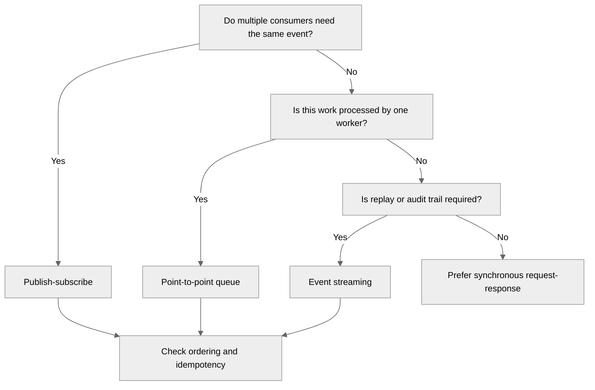
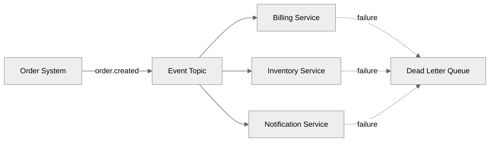
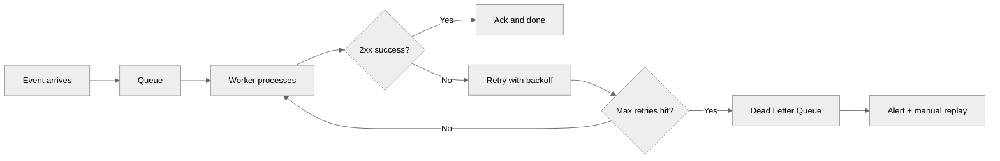

---
tags:
  - architecture
  - patterns
---

# Event-Driven Architecture Patterns

## 📝 Context

The customer is considering or already using an event-driven architecture — systems
that communicate through events rather than direct calls. Event-driven patterns enable
loose coupling, scalability, and real-time reactivity. They also introduce complexity
in debugging, ordering, and consistency that must be deliberately managed.

This page is built to be usable on a whiteboard. Each section pairs the *concept* with
a *worked example* and a *talk track* — the sentence you actually say when a customer or
interviewer asks "okay, but how would that work for us?"

## 📋 Decision Checklist: Should This Be Event-Driven?

- [ ] Producers and consumers have different availability or scaling requirements
- [ ] Multiple consumers need to react to the same event independently
- [ ] The system needs to handle bursty or unpredictable load
- [ ] Temporal decoupling is valuable (producer doesn't need to wait for consumer)
- [ ] An audit trail of all events is valuable
- [ ] Eventual consistency is acceptable for this use case

**If most of these are no:** Synchronous request-response is simpler and easier to debug.
Don't add event infrastructure for a system that's fundamentally request-response.

  
Say it like this

  
"Before I sketch anything — is this one event that one service consumes, or one event that several teams need to react to independently? That single answer decides whether we reach for a queue or a pub-sub topic."

## 🧩 Worked Scenario: Order Fan-Out

The canonical event-driven case. An e-commerce platform (say, Shopify) records an order.
Three downstream systems must react — billing, inventory, and customer notifications —
each with different ownership, availability, and scaling needs.

  

    
1 · Emit

    
Order system publishes one <code>order.created</code> event. It does not know or care who consumes it.

  

  

    
2 · Fan out

    
The topic delivers an independent copy to each subscriber. Billing being slow does not block notifications.

  

  

    
3 · Consume

    
Each service processes at its own pace, retries on its own failures, and is independently idempotent.

  

  

    
4 · Quarantine

    
A message that fails past max retries lands in the DLQ — visible and replayable, never silently dropped.

  

**Why this beats direct calls:** if the order system called billing → inventory →
notifications synchronously, one slow or down service would fail the whole order, and
adding a fourth consumer later would mean changing the order system. With fan-out, the
order system never changes when a new consumer is added.

  
Say it like this

  
"The order system emits one fact — 'this order happened' — and walks away. Billing, inventory, and notifications each pick it up on their own schedule. When you add a fourth consumer next quarter, the order system doesn't change a single line."

## 🎯 Core Patterns

### Event Types

Not all events are the same. Clarify which type you're working with — it changes how much
data travels and whether consumers must call back to the source.

| Type | Description | Example | Consumer Behavior |
| --- | --- | --- | --- |
| **Notification** | Something happened. Minimal data. | "Order 123 was placed" | Consumer fetches details from source if needed |
| **Event-carried state transfer** | Something happened, and here's all the data you need. | "Order 123 placed: {items, total, customer}" | Consumer acts without calling back to source |
| **Domain event** | A meaningful business occurrence in a bounded context. | "InventoryReserved" | Triggers downstream business logic |
| **Command** | A request for action disguised as a message. | "ProcessPayment" | Receiver is expected to act — this is async RPC, not pure event-driven |

**The trade-off that matters:** notifications keep payloads small but create chatty
callbacks to the source (and couple consumers to source availability).
Event-carried state transfer eliminates the callback but risks stale or bloated payloads
and leaks the source's schema to every consumer. Choose per event, not per system.

### Messaging Patterns

**Publish-Subscribe** — Producer publishes to a topic; multiple consumers subscribe and
receive independently; consumers don't know about each other. Best for fan-out, multiple
teams reacting to the same event.

**Point-to-Point Queue** — Producer sends to a queue; exactly one consumer processes each
message; messages consumed once. Best for task distribution, work queues, ordered processing.

**Event Streaming** — Events written to an append-only log (Kafka, Kinesis, Pulsar);
consumers read from an offset and can replay; the log retains events for a configurable
window. Best for audit trails, event sourcing, and consumers running at different speeds.

### Processing Patterns

- **Simple event processing:** one event triggers one action. "Order placed" → "send confirmation email."
- **Event correlation:** multiple events combine to trigger an action. "Payment received" + "inventory reserved" → "ship order." Requires a correlation mechanism (saga, process manager).
- **Complex event processing (CEP):** pattern detection across a stream. "More than 5 failed logins in 60 seconds from one IP" → "block IP." Requires a streaming processor (Flink, KSQL, Spark Streaming).

### Delivery Guarantees

| Guarantee | Meaning | Implementation Cost | When Required |
| --- | --- | --- | --- |
| **At-most-once** | May be lost, never duplicated | Lowest — fire and forget | Metrics, analytics where loss is acceptable |
| **At-least-once** | Will arrive, possibly more than once | Medium — requires acknowledgment + retry | Most business events — consumer must be idempotent |
| **Exactly-once** | Arrives exactly once | Highest — requires transactions or dedup | Financial transactions, inventory counts |

**Default to at-least-once with idempotent consumers.** Exactly-once is expensive and
fragile. Making consumers handle duplicates gracefully is almost always cheaper than
achieving true exactly-once delivery — and it degrades better under failure.

  
Say it like this

  
"I'd use at-least-once delivery and handle de-duplication on the receiver using the event ID as the key. That's cheaper and more resilient than chasing exactly-once across the network."

## 🛡️ Reliability & Error-Handling Layer

This is the layer that separates a demo from a production system. When a consumer or
destination is down, what happens to the event?

### Retry policy — with the numbers stated

Vague advice ("use exponential backoff") is what gets you a follow-up question you can't
answer. State the actual policy.

| Attempt | Delay | Why |
| --- | --- | --- |
| Retry 1 | ~1s | Most transient blips clear immediately |
| Retry 2 | ~2s | Delay doubles each attempt (exponential backoff) |
| Retry 3 | ~4s | Backs off further so a struggling endpoint can recover |
| After max | Cooldown, then DLQ | Stop hammering; quarantine for review/replay |

- **Exponential backoff:** the retry interval doubles each attempt so you don't hammer a struggling endpoint.
- **Jitter:** add randomness to each delay so all consumers don't retry at the exact same instant. Prevents a thundering-herd retry storm.
- **DLQ after max:** failed messages move to a dead letter queue for investigation and replay — never silent loss.

### Status codes drive the next action

The single highest-signal detail in this whole topic. Retrying blindly on every failure is
a junior mistake.

| Response | Action | Reasoning |
| --- | --- | --- |
| 2xx | Acknowledge, done | Success |
| 429 | Back off — never retry immediately | Rate limited; immediate retry makes it worse |
| 5xx | Retry with backoff | Server-side, likely transient |
| 4xx (not 429) | Do **not** retry → DLQ | Bad request won't fix itself on retry |

  
Say it like this

  
"On a 5xx I retry with exponential backoff and jitter. On a 429 I back off — never retry immediately, that just deepens the rate-limit hole. On a 4xx I don't retry at all; the payload is bad, so it goes straight to the dead letter queue for review."

## 🔁 Idempotency

**Definition:** an operation is idempotent if running it multiple times produces the same
result as running it once. Because at-least-once delivery means the same event can arrive
more than once, every consumer doing a state change must handle duplicates safely.

**The mechanism:** an idempotency key — a unique ID on the event, usually the source's
event or record ID. Before processing, check whether you've seen this key. If yes, skip.
If no, process and record the key.

| Scenario | Risk without idempotency | Fix |
| --- | --- | --- |
| Payment event fires twice | Customer charged twice | Check event ID before processing; store processed IDs |
| Record created twice | Duplicate data in destination | Upsert on external ID, not blind insert |
| Retry after a timeout | First delivery succeeded but the response was lost | At-least-once + idempotency key = safe |

  
Say it like this

  
"I assume every event can be delivered twice, so consumers upsert on the source record ID instead of inserting. The duplicate becomes a no-op instead of a double charge."

## 👁️ Observability — Who Sees What

A reliable system that nobody can see into still generates support tickets. Decide
deliberately what each audience sees.

| Audience | What they see | Why it matters |
| --- | --- | --- |
| **Engineering** | Full execution logs, payload inspection, step-by-step trace | Diagnose failures fast without touching production |
| **Customer Success** | Per-customer status, error summaries, a replay button | CS resolves common issues without pulling in engineers |
| **End customer** | Health status, last-run time, self-serve retry | Trust — they don't file tickets for things they can fix |
| **Alerting** | Stream to Datadog / PagerDuty / Slack on threshold breach | Catch failures *before* the customer reports them |

  
Say it like this

  
"The goal is that a failure is visible and recoverable, not silent. Engineering gets the stack trace, CS gets a replay button, and the customer gets a health indicator — so most issues never become a ticket."

## 🎯 Technology Selection

| Technology | Pattern | Ordering | Retention | Best For |
| --- | --- | --- | --- | --- |
| **AWS SQS** | Queue | Per-queue (FIFO) or best-effort | 14 days max | Simple work queues, decoupled processing |
| **AWS SNS** | Pub-sub | No ordering guarantee | None | Fan-out notifications |
| **Apache Kafka** | Streaming | Per-partition | Configurable (days to indefinite) | High-throughput streaming, event sourcing |
| **AWS Kinesis** | Streaming | Per-shard | 1–365 days | AWS-native streaming alternative to Kafka |
| **RabbitMQ** | Queue + Pub-sub | Per-queue | Until consumed | Flexible routing, complex topologies |
| **Azure Service Bus** | Queue + Pub-sub | Per-queue (sessions) | Configurable | Enterprise messaging with transactions |
| **Google Pub/Sub** | Pub-sub | Per-subscription (ordering key) | 31 days | GCP-native event distribution |

### Selection Criteria

- **Throughput:** events per second? Kafka and Kinesis handle millions; SQS handles tens of thousands.
- **Ordering:** must events process in order? Kafka guarantees per-partition; SQS FIFO guarantees per-group.
- **Retention:** need to replay? Kafka retains indefinitely; SQS discards after consumption.
- **Operational burden:** managed (SQS, SNS, Pub/Sub) vs. self-managed (Kafka — powerful but operationally expensive).
- **Ecosystem fit:** already run Kafka? Don't add SQS. Already on AWS for simple queuing? Don't add Kafka.

## ⚠️ Gotchas

- Treating everything as an event — synchronous calls are fine when you need an immediate response.
- No dead letter queue — failed messages disappear silently and data is lost.
- Ordering assumptions — most systems guarantee only per-partition/group order, never global.
- Consumer lag going unmonitored — a consumer falling behind is a ticking time bomb.
- Not making consumers idempotent — at-least-once delivery *means* duplicates happen.
- Event schemas without versioning — schema changes silently break consumers.
- "We'll just use Kafka" for simple queuing — SQS handles simple cases with zero operational overhead.
- No replay strategy — when something breaks, you want to reprocess from a known point.

## 🔗 Links

- [Microservices Patterns](microservices.md)
- [API Gateway Patterns](api-gateway.md)
- [Data Mesh Patterns](data-mesh.md)
- [Design Review](../architecture/design-review.md)
- [Reference Architectures](../architecture/reference-architectures.md)
