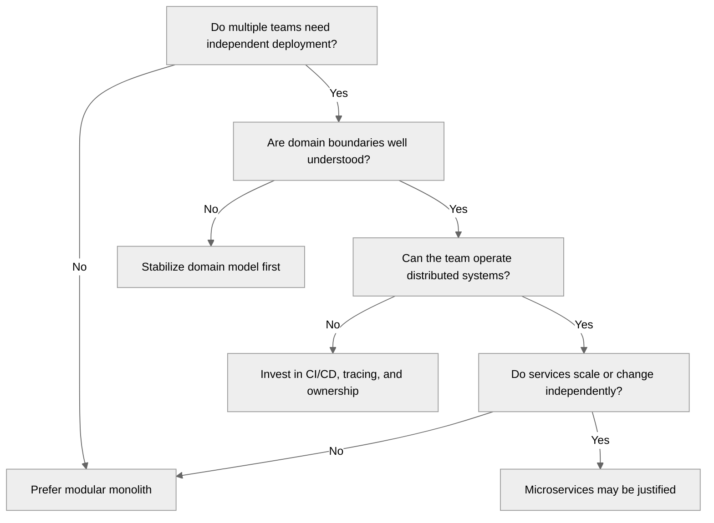
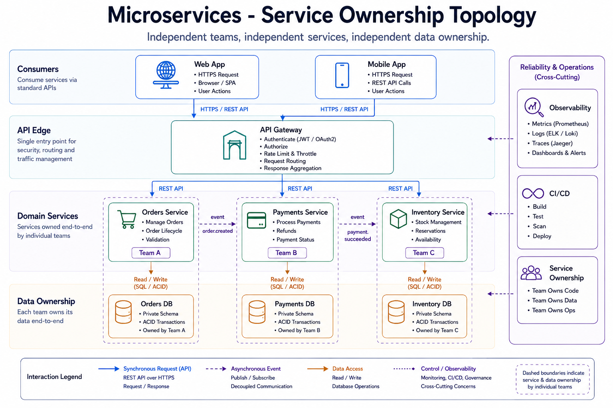

---
tags:
  - architecture
  - patterns
---

## Microservices Architecture Patterns

## 📝 Context

A customer is considering microservices, already running them, or dealing with the
consequences of a microservices migration. Your job is to help them understand when
microservices are the right choice, what patterns to apply, and how to avoid the
common failure modes that turn a microservices architecture into a distributed monolith.

## 📋 Decision Checklist: Should This Be Microservices?

Before recommending microservices, validate these prerequisites:

- [ ] Multiple teams need to deploy independently (organizational driver)
- [ ] Services have genuinely different scaling requirements
- [ ] Domain boundaries are well understood (not still being discovered)
- [ ] Team has operational maturity for distributed systems (monitoring, tracing, incident response)
- [ ] CI/CD pipeline supports per-service deployment
- [ ] The complexity cost is justified by the independence gained

**If most of these are no:** A well-structured monolith or modular monolith is probably
the better choice. Microservices are an organizational scaling pattern, not a technical
improvement for small teams.

<figure class="sp-figure">
  
  <figcaption>Independent teams, independent services, independent data ownership — each domain owns its service and its database.</figcaption>
</figure>

## 🎯 Core Patterns

### Service Decomposition

**How to draw service boundaries:**

- **By business domain** (Domain-Driven Design) — each service owns a bounded context
  with its own data, logic, and API. This is the strongest decomposition strategy
  because it aligns service boundaries with organizational boundaries.

- **By data ownership** — each service owns its data store. If two services need the
  same data, one owns it and the other requests it via API. Shared databases are
  the fastest path to a distributed monolith.

- **By rate of change** — services that change frequently should be independent from
  services that are stable. This minimizes deployment risk.

**Anti-patterns in decomposition:**

- Services split by technical layer (API service, business logic service, data service)
  — this creates distributed layers, not independent services
- Services that can't function without synchronous calls to 3+ other services — this
  is a distributed monolith with network overhead
- Services with shared databases — coupling at the data layer defeats the purpose

### Communication Patterns

| Pattern | When to Use | Tradeoffs |
| --- | --- | --- |
| **Synchronous REST/gRPC** | Request-response where the caller needs an immediate answer | Simple, but creates temporal coupling. Caller blocks until response. Cascading failures if downstream is slow. |
| **Async messaging (queues)** | Work that can be processed later, decoupled producers and consumers | Decouples services, absorbs load spikes. Harder to debug, eventual consistency. |
| **Event streaming (Kafka, etc.)** | Multiple consumers need the same event, event sourcing, audit trails | Scalable, replayable. Operational complexity, ordering challenges. |
| **Choreography** | Services react to events independently, no central coordinator | Loose coupling. Hard to understand the full flow, hard to handle failures. |
| **Orchestration (Saga)** | Multi-step workflows that span services and need coordination | Clear flow, easier error handling. Central coordinator can become a bottleneck. |

See also: [Event-Driven Patterns](event-driven.md)

### Data Management

**Database per service:** Each service owns its data store. This is the default for
microservices. The consequence is that cross-service queries require API calls or
materialized views.

**Saga pattern for distributed transactions:** When a business operation spans multiple
services, use a saga (sequence of local transactions with compensating actions) instead
of distributed transactions. Distributed transactions (2PC) don't scale and create
tight coupling.

**CQRS (Command Query Responsibility Segregation):** Separate the write model from the
read model when query patterns differ significantly from write patterns. Common in
event-sourced systems.

**Event sourcing:** Store state as a sequence of events rather than current state.
Provides complete audit trail and enables temporal queries. Adds significant complexity
— use only when the audit trail or temporal capability is a hard requirement.

### Resilience Patterns

**Circuit breaker:** When a downstream service is failing, stop calling it temporarily
to prevent cascading failures. After a timeout, try again (half-open state). If it
succeeds, close the circuit. If it fails, keep it open.

**Retry with exponential backoff:** Retry transient failures, but increase the delay
between retries to avoid overwhelming a recovering service. Add jitter to prevent
thundering herd.

**Bulkhead:** Isolate resources (thread pools, connection pools) per downstream dependency
so a slow service can't consume all resources and affect calls to healthy services.

**Timeout:** Set explicit timeouts on all inter-service calls. A service without a timeout
will wait forever for a response that may never come.

**Fallback:** When a dependency fails, degrade gracefully. Serve cached data, return a
default, or skip the feature rather than failing the entire request.

### Observability

You cannot run microservices without distributed tracing, centralized logging, and
service-level metrics. This is not optional.

- **Distributed tracing:** Trace requests across service boundaries (Jaeger, Zipkin, OpenTelemetry)
- **Centralized logging:** All service logs in one place with correlation IDs
- **Service metrics:** Latency, error rate, throughput per service (RED metrics)
- **Service dependency map:** Visualize which services call which, with latency and error data
- **Alerting:** Per-service SLOs with alert thresholds

## 🎯 Evaluating a Customer's Microservices Architecture

When reviewing an existing microservices architecture, look for:

| Smell | What It Indicates | Recommendation |
| --- | --- | --- |
| Services that always deploy together | Boundary is wrong — these are one service | Merge them |
| Shared database between services | Data coupling defeating independence | Migrate to database-per-service |
| Synchronous call chains 4+ deep | Distributed monolith | Introduce async messaging, rethink boundaries |
| No distributed tracing | Incidents take hours to diagnose | Implement OpenTelemetry before adding more services |
| Every service is a different tech stack | "Polyglot" taken too far | Standardize on 2-3 stacks maximum |
| 50 services for a 5-person team | Over-decomposed | Consolidate into fewer, coarser services |

## ⚠️ Gotchas

- Microservices as a default — they're a tool for organizational scaling, not a universal architecture
- Decomposing too early — break apart a monolith when you understand the domain boundaries, not before
- Shared databases — the single most common way to accidentally build a distributed monolith
- Ignoring operational cost — each service needs monitoring, logging, deployment pipeline, on-call coverage
- No service ownership model — every service needs a team that owns it
- Testing in isolation without integration tests — unit tests pass, production breaks
- "Let's use a different language for each service" — polyglot is a liability at small team sizes

## 🔗 Links

- [Event-Driven Patterns](event-driven.md)
- [API Gateway Patterns](api-gateway.md)
- [Data Mesh Patterns](data-mesh.md)
- [Design Review](../architecture/design-review.md)
- [Reference Architectures](../architecture/reference-architectures.md)
- [Well-Architected Review](../architecture/well-architected.md)
